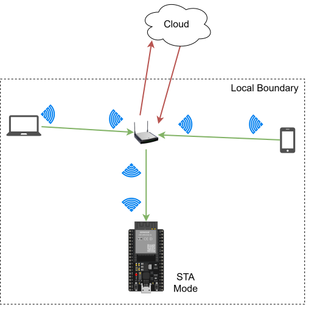
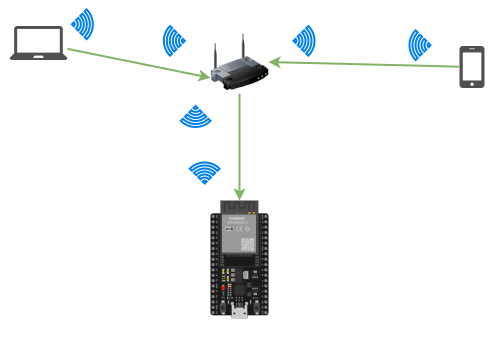
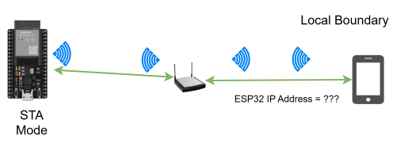
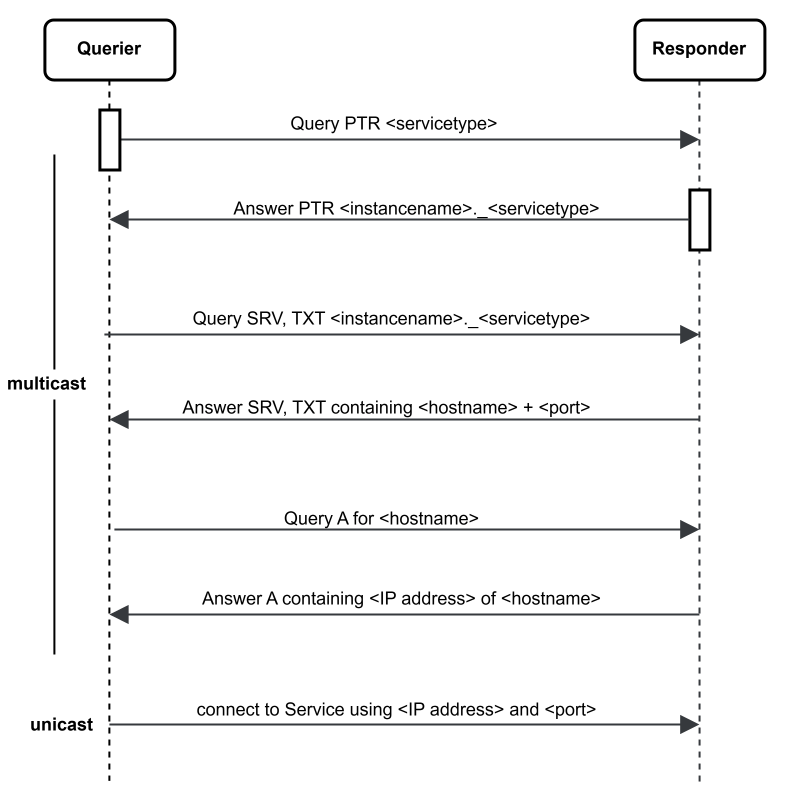

# 10.1 สถาปัตยกรรม Local Control และการค้นหาอุปกรณ์ (Local Control Architecture & Discovery)

## 10.1.1 กล่าวนำ (Introduction)

ในอดีต การควบคุมเครื่องใช้ไฟฟ้าและอุปกรณ์อิเล็กทรอนิกส์ต่างๆ ภายในบ้านเรือน เรามักจะทำการควบคุมผ่านสายไฟหรือสายสัญญาณ เช่น การต่อสายตรงจากสวิตช์ไฟไปยังหลอดไฟ ซึ่งเป็นการควบคุมแบบจุดต่อจุด (Point-to-Point) 

เมื่อเทคโนโลยีก้าวหน้าขึ้น เราเริ่มใช้รีโมตคอนโทรลที่ส่งสัญญาณผ่านคลื่นอินฟราเรด (IR) หรือคลื่นวิทยุ (RF) ซึ่งเป็นการควบคุมแบบไร้สาย แต่ยังมีข้อจำกัดเรื่องระยะทางการส่งสัญญาณและทิศทาง ต่อมาเมื่อโลกก้าวเข้าสู่ยุคอินเทอร์เน็ต เราสามารถสั่งงานอุปกรณ์ต่างๆ ได้จากทุกที่ทั่วโลกผ่านเครือข่ายอินเทอร์เน็ต ซึ่งเรียกว่า **Cloud Control** ทว่าระบบนี้มีความซับซ้อนและมีองค์ประกอบที่มากกว่า **Local Control**

ในระบบ IoT ยุคแรก อุปกรณ์มักถูกออกแบบให้ส่งข้อมูลขึ้นระบบคลาวด์เป็นหลัก (**Cloud-centric Architecture**) เมื่อผู้ใช้ต้องการสั่งงาน (เช่น เปิดหลอดไฟในห้องนั่งเล่น) คำสั่งจะต้องเดินทางจากสมาร์ตโฟนขึ้นไปยังคลาวด์เซิร์ฟเวอร์ ก่อนจะถูกส่งกลับลงมายังอุปกรณ์ที่บ้าน

<p align="center">
  
</p>

<p align="center"><b>รูปที่ 10.1</b> สถาปัตยกรรมระบบควบคุมผ่าน Cloud (Cloud Control)</p>

แม้ว่าระบบคลาวด์จะอำนวยความสะดวกในการควบคุมระยะไกล (Remote Control) จากนอกบ้านได้ แต่ก็มีจุดอ่อนสำคัญ 3 ประการ ได้แก่
1. **ความหน่วงเวลา (Latency)**  

   คำสั่งควบคุมต้องเดินทางผ่านเครือข่ายอินเทอร์เน็ตหลาย Hop ทำให้เกิดความหน่วงเวลา (50 ms ถึงหลายวินาที) ซึ่งอาจทำให้ผู้ใช้เข้าใจผิดว่าอุปกรณ์ตอบสนองช้าหรือไม่ทำงาน (เช่น กดเปิดสวิตช์หลอดไฟแล้วไฟไม่ติดทันที)
1. **การพึ่งพาอินเทอร์เน็ต (Internet Dependency)**  

   หากลิงก์อินเทอร์เน็ตของผู้ให้บริการขาดหาย ระบบควบคุมภายในบ้านจะหยุดทำงานทันที (Device Paralysis) แม้ผู้ใช้อยู่ติดกับตัวอุปกรณ์ในห้องเดียวกัน
2. **ความเป็นส่วนตัวและความปลอดภัย (Privacy & Security)** 

   ข้อมูลภาพ เสียง หรือสถานะการใช้งานภายในบ้านต้องถูกส่งออกสู่อินเทอร์เน็ตภายนอก ซึ่งมีความเสี่ยงต่อการถูกดักจับหรือโจรกรรมข้อมูลส่วนบุคคล

ในปัจจุบัน อุปกรณ์เครื่องใช้ไฟฟ้าอิเล็กทรอนิกส์บางชนิด (เช่น Smart TV) สามารถควบคุมผ่าน Smart Remote หรือสมาร์ตโฟนโดยตรงผ่าน **Bluetooth** ซึ่งไม่ต้องพึ่งพาเราเตอร์ Wi-Fi อย่างไรก็ตาม **Wi-Fi** ยังคงเป็นเทคโนโลยีหลักที่นิยมที่สุดในการควบคุมอุปกรณ์ IoT ภายในอาคาร เช่น ปลั๊กอัจฉริยะ (Smart Plug) สวิตช์ไฟ หรือเซนเซอร์ต่างๆ เนื่องจากมีแบนด์วิดท์สูงและเชื่อมโยงกับโครงข่ายเน็ตเวิร์กภายในบ้านได้อย่างสมบูรณ์

<p align="center">
  
</p>

<p align="center"><b>รูปที่ 10.2</b> สถาปัตยกรรมระบบควบคุมภายในเครือข่ายท้องถิ่นผ่าน Wi-Fi (Local Control)</p>

### ประโยชน์หลักของ Local Control
การใช้ Local control มีความสะดวกและปลอดภัยกว่าการใช้ cloud control ซึ่งสามารถจำแนกได้ดังต่อไปนี้
* **Real-time & Low Latency**  
  
  การสื่อสารอยู่ภายในเครือข่ายแลน (LAN) ความหน่วงมักต่ำกว่า 5–10 ms เมื่อสั่งเปิดไฟ หลอดไฟจะติดทันทีโดยไม่ต้องรอ Round-Trip Time ของอินเทอร์เน็ต
* **High Availability & Fault Tolerance** 
  
  ระบบยังคงทำงานได้ตามปกติแม้ไม่มีสัญญาณอินเทอร์เน็ตภายนอก การเปิด-ปิดไฟหรือเครื่องปรับอากาศในบ้านยังคงใช้งานได้ 100%
* **Data Locality & Privacy** 
  
  ข้อมูลเซนเซอร์ คำสั่งควบคุม และสถานะต่างๆ ถูกเก็บและแลกเปลี่ยนอยู่เฉพาะในวงแลน ไม่รั่วไหลออกนอกบ้าน
* **Bandwidth Saving** 
  
  ไม่สิ้นเปลืองแบนด์วิดท์ของอินเทอร์เน็ตเกตเวย์

---

## 10.1.2 ปัญหาการค้นหาอุปกรณ์ในเครือข่ายแลน (Device Discovery Problem)

เมื่อสมาร์ตโฟนและ ESP32 เชื่อมต่อเข้ากับเครือข่าย Wi-Fi เดียวกัน ESP32 จะทำหน้าที่เป็น **เซิร์ฟเวอร์ (Server)** เพื่อรอรับคำสั่งควบคุม และสมาร์ตโฟนจะทำหน้าที่เป็น **ไคลเอนต์ (Client)** เพื่อส่งคำสั่งไปสั่งงาน

ทว่าในระบบ Local Control เมื่อ ESP32 ได้รับหมายเลข IP Address ผ่าน DHCP จาก Router (เช่น `192.168.1.105`) ผู้ใช้งานหรือแอปพลิเคชันบนสมาร์ตโฟนจะ **ไม่ทราบว่า ESP32 ได้รับ IP อะไร**

<p align="center">
 
</p>
<p align="center"><b>รูปที่ 10.3</b> ปัญหาการค้นหาอุปกรณ์ในเครือข่ายแลน (Device Discovery Problem)</p>

การบังคับให้ผู้ใช้ค้นหาและกรอก IP Address เองเป็นวิธีที่ใช้งานยาก (Poor User Experience) เนื่องจาก IP Address อาจเปลี่ยนแปลงได้เมื่อเราเตอร์รีสตาร์ต แม้บางโปรเจกต์อาจแก้ปัญหาด้วยการติดจอแสดงผล OLED เล็กๆ เพื่อแสดง IP Address ของบอร์ด แต่ก็ยังไม่สะดวกต่อการใช้งานทั่วไปและไม่สอดคล้องกับแนวคิดของ IoT ที่อุปกรณ์ควรเชื่อมต่อและค้นหากันได้โดยอัตโนมัติ (Zero-Configuration)


### ข้อจำกัดของโปรโตคอลเครือข่ายดั้งเดิม (ARP / RARP)
ในระดับเครือข่ายคอมพิวเตอร์ มีโปรโตคอลจับคู่แอดเดรสอยู่ 2 ตัว
* **ARP (Address Resolution Protocol)** 
  
  ทราบที่อยู่ IP Address แล้วส่งคำถามเพื่อขอที่อยู่ MAC Address (Layer 2)
* **RARP (Reverse Address Resolution Protocol)** 
  
  ทราบที่อยู่ MAC Address แล้วส่งคำถามเพื่อขอที่อยู่ IP Address (Layer 3)

อย่างไรก็ตาม ทั้ง ARP และ RARP จำเป็นต้องทราบข้อมูลฝั่งใดฝั่งหนึ่งล่วงหน้า (ต้องทราบ MAC หรือ IP) ซึ่งในระบบ IoT เรามักไม่ทราบทั้ง MAC Address และ IP Address ของอุปกรณ์ใหม่ที่เพิ่งเปิดเครื่อง ดังนั้นเราจึงต้องใช้ **เทคโนโลยีการค้นหาแบบโลคอล (Local Discovery)** เข้ามาจัดการ

### การจำแนกรูปแบบการส่งข้อมูล IP
1. **Unicast (จุดต่อจุด - 1 ต่อ 1)**  
   
   ต้องทราบ IP Address ของปลายทางอย่างแม่นยำ จึง **ไม่สามารถ** นำมาใช้ค้นหาอุปกรณ์เริ่มต้นได้
1. **Broadcast (หนึ่งต่อทั้งหมด - 1 ต่อ All)**  
   
   ส่งข้อมูลไปยังที่อยู่บรอดแคสต์ ทุกโฮสต์ในเครือข่ายจะได้รับข้อมูล
1. **Multicast (หนึ่งต่อกลุ่มที่สนใจ - 1 ต่อ Many)**  
   
   ส่งข้อมูลไปยังที่อยู่กลุ่มเฉพาะ โฮสต์ที่สมัครเข้ากลุ่มเท่านั้นที่จะได้รับข้อมูล

ดังนั้น เทคนิคหลักในการค้นหาอุปกรณ์ในเครือข่ายแลนโดยไม่ทราบ IP ปลายทางล่วงหน้า จึงต้องพึ่งพา **Broadcast** หรือ **Multicast**

---

## 10.1.3 การค้นหาอุปกรณ์ด้วยวิธีบรอดแคสต์ (Broadcast Discovery)

**Broadcast** คือการส่งแพ็กเก็ตข้อมูลไปยังผู้รับทุกตัวที่เชื่อมต่ออยู่ในเครือข่าย โดยมีจุดประสงค์หลัก 2 ประการ
1. การระบุตำแหน่งและค้นหาโฮสต์ในเครือข่ายท้องถิ่น
2. การแจ้งเตือนข้อมูลข่าวสารไปยังทุกโฮสต์พร้อมกันในครั้งเดียว เพื่อลดปริมาณการส่งซ้ำ

> [!NOTE]
> การส่ง Broadcast ในระดับแอปพลิเคชันจะใช้โปรโตคอล **UDP** เสมอ เพราะ UDP เป็น Connectionless ไม่ต้องสร้างการเชื่อมต่อล่วงหน้า ต่างจาก TCP ที่รองรับเฉพาะ Unicast (จุดต่อจุด) เท่านั้น

### 10.1.3.1 ที่อยู่บรอดแคสต์ (Broadcast Addresses)
ที่อยู่บรอดแคสต์แบ่งออกเป็น 2 ระดับชั้น
* **Layer 2 (Data Link Layer)**  MAC Broadcast Address คือ `FF:FF:FF:FF:FF:FF`
* **Layer 3 (Network Layer)** IP Broadcast Address ซึ่งแบ่งย่อยเป็น 2 แบบ ประกอบด้วย
  1. **Limited Broadcast Address (`255.255.255.255`)** เมื่อส่งไปยังแอดเดรสนี้ ทุกอุปกรณ์ในวงแลนที่เชื่อมต่อกับเราเตอร์จะได้รับข้อความ และ MAC Address ที่ระดับ Layer 2 จะถูกแปลงเป็น `FF:FF:FF:FF:FF:FF` โดยอัตโนมัติ
  2. **Subnet-directed Broadcast Address** เกิดจากการคำนวณโดยให้ Host ID ทุกบิตเป็น 1 เช่น วงเครือข่าย `192.168.1.0/24` จะมี Subnet Broadcast Address คือ `192.168.1.255`

**ความแตกต่าง** หากเราเตอร์ตัวหนึ่งเชื่อมต่อ 2 Subnets (`192.168.1.0/24` และ `192.168.2.0/24`) การส่งไปยัง `192.168.1.255` จะถูกส่งต่อไปยังโฮสต์ในวง `192.168.1.x` เท่านั้น ไม่รบกวนวงอื่น จึงช่วยประหยัดทรัพยากรเครือข่ายได้ดีกว่า

---

### 10.1.3.2 การสร้างตัวส่งบรอดแคสต์ (Broadcast Sender) บน ESP-IDF
ฟังก์ชัน `esp_send_broadcast()` สร้าง UDP Socket ผ่านมาตรฐาน BSD Socket และใช้ฟังก์ชัน `setsockopt()` เพื่อเปิดตัวเลือก `SO_BROADCAST` จากนั้นส่งข้อความคำถาม `"Are you Espressif IOT Smart Light"` ไปยังพอร์ต `3333` ดังนี้

```c
#include <string.h>
#include <sys/socket.h>
#include <netinet/in.h>
#include <arpa/inet.h>
#include "esp_log.h"

static const char *TAG = "BROADCAST_SENDER";

esp_err_t esp_send_broadcast(void)
{
    int opt_val = 1;
    esp_err_t err = ESP_FAIL;
    struct sockaddr_in from_addr = {0};
    socklen_t from_addr_len = sizeof(struct sockaddr_in);
    char udp_recv_buf[64 + 1] = {0};

    // 1. สร้าง IPv4 UDP Socket (SOCK_DGRAM)
    int sockfd = socket(AF_INET, SOCK_DGRAM, 0);
    if (sockfd == -1) {
        ESP_LOGE(TAG, "Failed to create UDP socket");
        return err;
    }

    // 2. ตั้งค่า Socket Option SO_BROADCAST เพื่ออนุญาตให้ส่ง Broadcast ได้
    int ret = setsockopt(sockfd, SOL_SOCKET, SO_BROADCAST, &opt_val, sizeof(int));
    if (ret < 0) {
        ESP_LOGE(TAG, "Failed to set SO_BROADCAST option");
        goto exit;
    }

    // 3. กำหนด IP ปลายทางเป็น 255.255.255.255 และ Port 3333
    struct sockaddr_in dest_addr = {
        .sin_family = AF_INET,
        .sin_port = htons(3333),
        .sin_addr.s_addr = htonl(INADDR_BROADCAST),
    };

    char *broadcast_msg_buf = "Are you Espressif IOT Smart Light";

    // 4. ส่งแพ็กเก็ตบรอดแคสต์ด้วย sendto()
    ret = sendto(sockfd, broadcast_msg_buf, strlen(broadcast_msg_buf), 0,
                 (struct sockaddr *)&dest_addr, sizeof(struct sockaddr));
    if (ret < 0) {
        ESP_LOGE(TAG, "Error occurred during sending: errno %d", errno);
    } else {
        ESP_LOGI(TAG, "Broadcast message sent successfully");

        // 5. รอรับแพ็กเก็ตตอบกลับแบบ Unicast จากอุปกรณ์ปลายทาง
        ret = recvfrom(sockfd, udp_recv_buf, sizeof(udp_recv_buf) - 1, 0,
                       (struct sockaddr *)&from_addr, &from_addr_len);
        if (ret > 0) {
            ESP_LOGI(TAG, "Received UDP unicast reply from %s:%d | Data: %s",
                     inet_ntoa(from_addr.sin_addr),
                     ntohs(from_addr.sin_port),
                     udp_recv_buf);
            err = ESP_OK;
        }
    }

exit:
    close(sockfd);
    return err;
}
```

---

### 10.1.3.3 การสร้างตัวรับบรอดแคสต์ (Broadcast Receiver) บน ESP-IDF
ฝั่งอุปกรณ์ ESP32 ตัวรับจะทำการ `bind()` เข้ากับพอร์ต `3333` และใช้ `INADDR_ANY` เพื่อรอรับข้อความ เมื่อได้รับคำถามที่ถูกต้อง จะส่งข้อความ Unicast กลับไปยัง IP และพอร์ตของผู้ส่ง เพื่อแจ้งบริการที่รองรับ (เช่น `"ESP32-C3 Smart Light https 443"`) ดังตัวอย่างโค้ดต่อไปนี้

```c
esp_err_t esp_receive_broadcast(void)
{
    esp_err_t err = ESP_FAIL;
    struct sockaddr_in from_addr = {0};
    socklen_t from_addr_len = sizeof(struct sockaddr_in);
    char udp_server_buf[64 + 1] = {0};
    char *udp_server_send_buf = "ESP32-C3 Smart Light https 443";

    // 1. สร้าง IPv4 UDP Socket
    int sockfd = socket(AF_INET, SOCK_DGRAM, 0);
    if (sockfd == -1) {
        ESP_LOGE(TAG, "Failed to create UDP socket");
        return err;
    }

    // 2. กำหนดพอร์ต 3333 และรับทุก Interface (INADDR_ANY)
    struct sockaddr_in server_addr = {
        .sin_family = AF_INET,
        .sin_port = htons(3333),
        .sin_addr.s_addr = htonl(INADDR_ANY),
    };

    // 3. ผูก Socket เข้ากับพอร์ต
    int ret = bind(sockfd, (struct sockaddr *)&server_addr, sizeof(server_addr));
    if (ret < 0) {
        ESP_LOGE(TAG, "Failed to bind socket");
        goto exit;
    }

    ESP_LOGI(TAG, "Listening for broadcast messages on port 3333...");

    // 4. ลูปเพื่อรอรับข้อมูล
    while (1) {
        ret = recvfrom(sockfd, udp_server_buf, sizeof(udp_server_buf) - 1, 0,
                       (struct sockaddr *)&from_addr, &from_addr_len);
        if (ret > 0) {
            udp_server_buf[ret] = '\0';
            ESP_LOGI(TAG, "Received broadcast from %s:%d | Data: %s",
                     inet_ntoa(from_addr.sin_addr),
                     ntohs(from_addr.sin_port),
                     udp_server_buf);

            // ตรวจสอบความถูกต้องของข้อความคำถาม
            if (!strcmp(udp_server_buf, "Are you Espressif IOT Smart Light")) {
                // ตอบกลับผู้ส่งด้วยแพ็กเก็ต Unicast
                ret = sendto(sockfd, udp_server_send_buf, strlen(udp_server_send_buf), 0,
                             (struct sockaddr *)&from_addr, from_addr_len);
                if (ret < 0) {
                    ESP_LOGE(TAG, "Failed to send unicast reply");
                } else {
                    ESP_LOGI(TAG, "Replied unicast successfully to %s", inet_ntoa(from_addr.sin_addr));
                }
            }
        }
    }

exit:
    close(sockfd);
    return err;
}
```

### 10.1.3.4 ตัวอย่างผลการทำงานบน Serial Monitor
```text
[ฝั่ง Sender ส่ง Broadcast] 
I (1544) wifi station: got ip:192.168.3.5
I (1554) wifi station: Broadcast message sent successfully
I (1624) wifi station: Received UDP unicast reply from 192.168.3.80:3333 | Data: ESP32-C3 Smart Light https 443

[ฝั่ง Receiver รับ Broadcast]
I (3050) wifi station: got ip:192.168.3.80
I (26490) wifi station: Received broadcast from 192.168.3.5:60520 | Data: Are you Espressif IOT Smart Light
I (26500) wifi station: Replied unicast successfully to 192.168.3.5
```

> [!WARNING] **ข้อจำกัดของ Broadcast**
> แม้ว่า Broadcast จะใช้งานง่าย แต่เนื่องจากแพ็กเก็ตจะถูกส่งไปยังอุปกรณ์ **ทุกตัว** ในเครือข่าย บังคับให้อุปกรณ์อื่น (ที่ไม่ใช่หลอดไฟหรืออุปกรณ์ IoT ของเรา เช่น คอมพิวเตอร์ สมาร์ตโฟนคนอื่น) ต้องถูกขัดจังหวะเพื่ออ่านและทิ้งแพ็กเก็ตนี้ หากมีอุปกรณ์จำนวนมาก จะทำให้เครือข่ายติดขัดและเปลืองพลังงาน

Code ตัวอย่างด้านบน ใช้ ESP32-C3 เป็น smart device ซึ่งใน ESP32 รุ่นทั่วไปก็สามารถทำได้เช่นเดียวกัน

---

## 10.1.4 การค้นหาอุปกรณ์ด้วยวิธีมัลติแคสต์ (Multicast Discovery)

**Multicast** คือการส่งข้อความไปยังกลุ่มเฉพาะ (**One-to-Many**) ที่มีความสนใจร่วมกัน แทนที่จะยิงหว่านไปหาทุกคนเหมือน Broadcast โดยอาศัยโปรโตคอล **IGMP (Internet Group Management Protocol)** ในการบริหารจัดการสมาชิกของกลุ่ม

### 10.1.4.1 แอดเดรสของมัลติแคสต์ (Multicast Addresses)
Multicast ใช้ IP Address ใน **Class D (ขึ้นต้นด้วยบิต `1110` ตั้งแต่ `224.0.0.0` ถึง `239.255.255.255`)**
* **`224.0.0.0` ถึง `224.0.0.255`**  Reserved Multicast สำหรับโปรโตคอลระบบเครือข่ายภายใน (เช่น `224.0.0.251` สำหรับ mDNS)
* **`224.0.1.0` ถึง `224.0.1.255`**  Public Multicast สำหรับอินเทอร์เน็ตสาธารณะ
* **`224.0.2.0` ถึง `238.255.255.255`**  User Multicast ชั่วคราวสำหรับแอปพลิเคชันทั่วไป
* **`239.0.0.0` ถึง `239.255.255.255`**  Local Management Multicast สำหรับการใช้งานภายในองค์กรหรือวงแลนส่วนบุคคล

---

### 10.1.4.2 การสร้างตัวส่งมัลติแคสต์ (Multicast Sender) บน ESP-IDF
การส่ง Multicast มีความซับซ้อนกว่า Broadcast เล็กน้อย เนื่องจากต้องกำหนด Interface ขาออก (`IP_MULTICAST_IF`), กำหนดค่า TTL (`IP_MULTICAST_TTL = 1` เพื่อไม่ให้แพ็กเก็ตหลุดออกนอกเราเตอร์), และต้องเข้าร่วมกลุ่ม (`IP_ADD_MEMBERSHIP`) เพื่อรอรับคำตอบ ดัง code  ต่อไปนี้

```c
#define MULTICAST_IPV4_ADDR "232.10.11.12"
#define MULTICAST_PORT      3333

// ฟังก์ชันสำหรับกำหนด Network Interface และเข้าร่วมกลุ่ม Multicast
static int esp_join_multicast_group(int sockfd)
{
    struct ip_mreq imreq = {0};
    struct in_addr iaddr = {0};
    esp_netif_ip_info_t ip_info = {0};

    // 1. อ่าน IP ของ Wi-Fi Station
    esp_err_t err = esp_netif_get_ip_info(esp_netif_get_handle_from_ifkey("WIFI_STA_DEF"), &ip_info);
    if (err != ESP_OK) {
        ESP_LOGE(TAG, "Failed to get IP address info");
        return -1;
    }
    inet_addr_from_ip4addr(&iaddr, &ip_info.ip);

    // 2. กำหนด Interface ขาออกของ Multicast ด้วย IP_MULTICAST_IF
    if (setsockopt(sockfd, IPPROTO_IP, IP_MULTICAST_IF, &iaddr, sizeof(struct in_addr)) < 0) {
        ESP_LOGE(TAG, "Failed to set IP_MULTICAST_IF: errno %d", errno);
        return -1;
    }

    // 3. กำหนด Multicast Group Address และลงทะเบียนด้วย IP_ADD_MEMBERSHIP
    inet_aton(MULTICAST_IPV4_ADDR, &imreq.imr_multiaddr.s_addr);
    imreq.imr_interface.s_addr = iaddr.s_addr;
    if (setsockopt(sockfd, IPPROTO_IP, IP_ADD_MEMBERSHIP, &imreq, sizeof(struct ip_mreq)) < 0) {
        ESP_LOGE(TAG, "Failed to set IP_ADD_MEMBERSHIP: errno %d", errno);
        return -1;
    }
    return 0;
}

esp_err_t esp_send_multicast(void)
{
    esp_err_t err = ESP_FAIL;
    struct sockaddr_in saddr = {0};
    struct sockaddr_in from_addr = {0};
    socklen_t from_addr_len = sizeof(struct sockaddr_in);
    char udp_recv_buf[64 + 1] = {0};

    // 1. สร้าง UDP Socket
    int sockfd = socket(AF_INET, SOCK_DGRAM, 0);
    if (sockfd == -1) return ESP_FAIL;

    // 2. ผูก Socket เข้ากับพอร์ต 3333
    saddr.sin_family = PF_INET;
    saddr.sin_port = htons(MULTICAST_PORT);
    saddr.sin_addr.s_addr = htonl(INADDR_ANY);
    bind(sockfd, (struct sockaddr *)&saddr, sizeof(struct sockaddr_in));

    // 3. ตั้งค่า TTL = 1 เพื่อจำกัดแพ็กเก็ตให้อยู่เฉพาะภายในวงแลนนี้เท่านั้น
    uint8_t ttl = 1;
    setsockopt(sockfd, IPPROTO_IP, IP_MULTICAST_TTL, &ttl, sizeof(uint8_t));

    // 4. เข้าร่วมกลุ่ม Multicast
    if (esp_join_multicast_group(sockfd) < 0) {
        close(sockfd);
        return ESP_FAIL;
    }

    // 5. ส่งข้อความไปยัง Multicast IP Address
    struct sockaddr_in dest_addr = {
        .sin_family = AF_INET,
        .sin_port = htons(MULTICAST_PORT),
    };
    inet_aton(MULTICAST_IPV4_ADDR, &dest_addr.sin_addr.s_addr);

    char *msg = "Are you Espressif IOT Smart Light";
    sendto(sockfd, msg, strlen(msg), 0, (struct sockaddr *)&dest_addr, sizeof(dest_addr));
    ESP_LOGI(TAG, "Multicast discovery packet sent to %s:%d", MULTICAST_IPV4_ADDR, MULTICAST_PORT);

    // 6. รอรับ Unicast ตอบกลับ
    int ret = recvfrom(sockfd, udp_recv_buf, sizeof(udp_recv_buf) - 1, 0,
                       (struct sockaddr *)&from_addr, &from_addr_len);
    if (ret > 0) {
        udp_recv_buf[ret] = '\0';
        ESP_LOGI(TAG, "Received Unicast reply from %s:%d | Data: %s",
                 inet_ntoa(from_addr.sin_addr), ntohs(from_addr.sin_port), udp_recv_buf);
        err = ESP_OK;
    }

    close(sockfd);
    return err;
}
```

---

## 10.1.5 ตารางเปรียบเทียบ Broadcast vs Multicast

| มิติการเปรียบเทียบ                    | การบรอดแคสต์ (Broadcast)                        | การมัลติแคสต์ (Multicast)                           |
| :------------------------------------ | :---------------------------------------------- | :-------------------------------------------------- |
| **หลักการทำงาน**                      | ส่งแพ็กเก็ตไปยังทุกโฮสต์ในเครือข่าย             | ส่งแพ็กเก็ตเฉพาะกลุ่มโฮสต์ที่สนใจและลงทะเบียนไว้    |
| **รูปแบบการส่ง (Mode)**               | One-to-All (หนึ่งต่อทั้งหมด)                    | One-to-Many (หนึ่งต่อเฉพาะกลุ่ม)                    |
| **การจัดการกลุ่ม (Group Management)** | ไม่มีการจัดการกลุ่ม                             | ใช้โปรโตคอล **IGMP** ในการสมัครและถอนตัวจากกลุ่ม    |
| **ผลกระทบต่อแบนด์วิดท์เครือข่าย**     | อาจก่อให้เกิดความแออัด (Broadcast Storm)        | ควบคุมแบนด์วิดท์ได้ดี ไม่รบกวนโฮสต์อื่น             |
| **ผลกระทบต่อ CPU ของโฮสต์อื่น**       | สูง (ทุกโฮสต์ต้องถูกขัดจังหวะเพื่อทิ้งแพ็กเก็ต) | ต่ำมาก (เฉพาะการ์ดที่ Subscribe กลุ่มจึงจะประมวลผล) |
| **ความเหมาะสมกับงาน IoT**             | เหมาะสำหรับเครือข่ายขนาดเล็กมาก                 | **เหมาะสมที่สุดสำหรับระบบ IoT อัจฉริยะ**            |

---

## 10.1.6 โปรโตคอล Multicast DNS (mDNS) สำหรับการค้นหาอุปกรณ์

แม้ว่า Multicast ด้วย Raw Socket จะมีประสิทธิภาพสูง แต่การที่ผู้พัฒนาต้องมากำหนด Multicast IP และสร้างรูปแบบแพ็กเก็ตเองก็ยังขาดความเป็นมาตรฐานสากล

เพื่อแก้ปัญหานี้ จึงได้เกิดโปรโตคอลมาตรฐานชื่อ **mDNS (Multicast DNS - RFC 6762)** ซึ่งนำเอารูปแบบของระบบ DNS ดั้งเดิมมาทำงานผ่าน Multicast
* ทำงานบนพอร์ต **UDP 5353**
* ส่งข้อมูลไปยัง Multicast Address มาตรฐาน: **`224.0.0.251`** (IPv4) หรือ **`ff02::fb`** (IPv6)
* ใช้นามสกุลโดเมนพิเศษคือ **`.local`** เช่น `my_smart_light.local`
* ไม่ต้องติดตั้งเครื่องเซิร์ฟเวอร์ DNS ส่วนกลาง (Zero-Configuration Networking)
* รองรับมาตรฐาน **DNS-SD (DNS Service Discovery - RFC 6763)** เพื่อบอกประเภทบริการ (Service Type เช่น `_http._tcp`) และหมายเลขพอร์ตได้ในตัว

<p align="center">

</p>

<p align="center">
<b>รูปที่ 10.4</b> ลำดับขั้นตอนการค้นหาและจับคู่บริการด้วย mDNS และ DNS-SD (RFC 6762 / 6763)
</p>

จากรูป 10.4 มีคำย่อต่างๆ ที่ต้องอธิบายเพิ่มเติมดังต่อไปนี้

| ตัวย่อ       | คำเต็ม                                                           | ความหมาย                                                      | หน้าที่ใน mDNS / DNS-SD                                                                                                                                                                                                                                                                                                                                                                                   |
| ------------ | ---------------------------------------------------------------- | ------------------------------------------------------------- | --------------------------------------------------------------------------------------------------------------------------------------------------------------------------------------------------------------------------------------------------------------------------------------------------------------------------------------------------------------------------------------------------------- |
| **PTR**      | **Pointer Record**<br>                                           | ระเบียนตัวชี้ (Pointer)                                       | - ใช้ทำ **Service Discovery (ค้นหาว่ามีใครให้บริการบ้าง)**<br>- ชี้จาก **"ประเภทของบริการ (Service Type)"** ไปยัง **"ชื่ออุปกรณ์ที่ให้บริการ (Service Instance Name)"**<br>- _ตัวอย่าง_: เมื่อไคลเอนต์ถามว่า _"ในวงแลนนี้ มีใครเปิดบริการเว็บ `_http._tcp` บ้าง?"_ $\rightarrow$ ESP32 จะตอบกลับด้วยระเบียน PTR ชี้ไปที่ชื่อตัวเองคือ `esp32_smart_light._http._tcp.local`                                |
| **SRV**      | **Service Record** <br>(Service Location Record - RFC 2782) <br> | ระเบียนระบุตำแหน่งที่ตั้งของบริการ                            | - ใช้ระบุว่าบริการนั้นรันอยู่บน **Hostname ใด** และเปิดให้บริการอยู่ที่ **Port หมายเลขใด**<br>- _ตัวอย่าง_: บอกว่าบริการ `esp32_smart_light` ทำงานอยู่ที่เครื่องโฮสต์ `my_smart_light.local` บนพอร์ต `80` (ทำให้ไคลเอนต์รู้ว่าจะต้องเปิดการเชื่อมต่อไปยังพอร์ตใด)<br>                                                                                                                                     |
| **TXT**      | **Text Record**                                                  | ระเบียนข้อความอักขระ                                          | ใช้เก็บ **ข้อมูลเมทาดาทาเพิ่มเติม (Metadata / Key-Value Pairs)** ของอุปกรณ์ เพื่อให้ไคลเอนต์ทราบรายละเอียดเบื้องต้นก่อนที่จะเชื่อมต่อจริง<br>- ตัวอย่าง<br>        mdns_txt_item_t serviceTxtData[] = {<br>            {"board", "esp32"},<br>            {"path", "/api/v1/control"}<br>        };<br>ระเบียน TXT จะส่งคู่ข้อความ `board=esp32` และ `path=/api/v1/control` ไปให้แอปบนมือถือทราบทันที<br> |
| **A Record** | **Address Record**                                               | ระเบียนที่อยู่ IPv4 (หากเป็น IPv6 จะเรียกว่า **AAAA Record**) | ทำการแปลงชื่อ Hostname (เช่น `my_smart_light.local`) ให้กลายเป็น **หมายเลข IP Address จริง** (เช่น `192.168.3.80`) เพื่อให้ไคลเอนต์สามารถยิงแพ็กเก็ตไปยังบอร์ดได้ถูกต้อง<br>                                                                                                                                                                                                                              |
### 10.1.6.1 การเปิดใช้งาน mDNS ด้วยคอมโพเนนต์ทางการของ ESP-IDF

ESP-IDF มีไลบรารี `mdns` มาให้อย่างสมบูรณ์ การเริ่มต้นและลงทะเบียนบริการทำได้ดังนี้:

```c
#include "mdns.h"

esp_err_t esp_mdns_discovery_start(void)
{
    char *host_name = "my_smart_light";
    char *instance_name = "esp32_smart_light";

    // 1. เริ่มต้นระบบ mDNS
    if (mdns_init() != ESP_OK) {
        ESP_LOGE(TAG, "mdns_init failed");
        return ESP_FAIL;
    }

    // 2. กำหนด Hostname (สำหรับเรียกผ่าน http://my_smart_light.local)
    if (mdns_hostname_set(host_name) != ESP_OK) {
        ESP_LOGE(TAG, "mdns_hostname_set failed");
        goto err;
    }
    ESP_LOGI(TAG, "mDNS Hostname set to: [%s.local]", host_name);

    // 3. กำหนด Instance Name เพื่อให้อุปกรณ์อื่นค้นหาเจอในระบบ
    if (mdns_instance_name_set(instance_name) != ESP_OK) {
        ESP_LOGE(TAG, "mdns_instance_name_set failed");
        goto err;
    }

    // 4. ประกาศบริการ HTTP (Port 80) พร้อมระบุ Metadata ใน TXT Records
    mdns_txt_item_t serviceTxtData[2] = {
        {"board", "esp32"},
        {"path", "/api/v1/control"}
    };

    if (mdns_service_add(instance_name, "_http", "_tcp", 80, serviceTxtData, 2) != ESP_OK) {
        ESP_LOGE(TAG, "mdns_service_add failed");
        goto err;
    }

    return ESP_OK;

err:
    mdns_free();
    return ESP_FAIL;
}
```

---

### 10.1.6.2 การทดสอบค้นหาอุปกรณ์จากเครื่องคอมพิวเตอร์ Client

#### 1. บนระบบปฏิบัติการ Windows (ผ่าน Apple Bonjour / dns-sd)
```powershell
dns-sd -L esp32_smart_light _http._tcp
```
*ผลลัพธ์ที่ได้:*
```text
Lookup esp32_smart_light._http._tcp.local
esp32_smart_light._http._tcp.local. can be reached at my_smart_light.local.:80
path=/api/v1/control board=esp32
```

#### 2. บนระบบปฏิบัติการ Linux / macOS (ผ่าน Avahi)
```bash
avahi-browse -a --resolve
```
*ผลลัพธ์ที่ได้*
```text
= enp1s0 IPv4 esp32_smart_light Web Site local
  hostname = [my_smart_light.local]
  address  = [192.168.3.80]
  port     = [80]
  txt      = ["board=esp32" "path=/api/v1/control"]
```

#### 3. การทดสอบเชื่อมต่อทั่วไป
ผู้ใช้สามารถใช้คำสั่งพื้นฐานอย่าง `ping` หรือเปิดเว็บบราวเซอร์
```powershell
ping my_smart_light.local
```
ระบบจะ Resolve ชื่อ `my_smart_light.local` กลับมาเป็น IP Address จริงของ ESP32

---

## 10.1.7 สรุป
1. **Local Control** มอบความเร็ว (Low Latency), ความเสถียร (ทำงานได้แม้ไม่มีเน็ตบ้าน), และความเป็นส่วนตัวของข้อมูลที่เหนือกว่า Cloud Control
2. **การค้นหาอุปกรณ์ (Discovery)** โดยไม่ทราบ IP เริ่มต้น ต้องอาศัย **Broadcast** หรือ **Multicast** 
3. **Multicast** เหนือกว่า Broadcast อย่างมาก เนื่องจากไม่รบกวนอุปกรณ์อื่นที่ไม่เกี่ยวข้องในเครือข่าย
4. **mDNS (RFC 6762)** คือมาตรฐานสากลระดับสูงสุดของ Local Discovery ที่ทำให้เราเรียกชื่อโฮสต์ `.local` และประกาศ Service พอร์ตผ่าน DNS-SD ได้อัตโนมัติ
5. ในหัวข้อถัดไป ([10.2 HTTP Server & RESTful API](02-HTTP-Server-and-RESTful-API-on-ESP-IDF.md)) เราจะนำชื่อโฮสต์ mDNS นี้ ไปสร้าง Web API สำหรับส่งคำสั่งควบคุมฮาร์ดแวร์จริง
