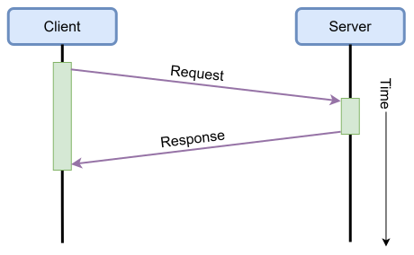

# 10.2 เว็บเซิร์ฟเวอร์ HTTP และสถาปัตยกรรม RESTful API บน ESP-IDF 

## 1. โปรโตคอล HTTP ในงานควบคุมอุปกรณ์ 

ในการสื่อสารข้อมูลระดับเครือข่ายท้องถิ่น แม้ว่าเราจะสามารถเขียนโปรแกรมสร้างการเชื่อมต่อผ่าน **TCP Socket** ดั้งเดิมเพื่อส่งข้อความสตรีมแบบไบนารีหรือข้อความธรรมดา (เช่น ส่งคำว่า `"Open the light"`) ได้โดยตรง แต่การใช้ Raw TCP Socket มีข้อจำกัดหลายประการ เช่น
1. **การขาดรูปแบบมาตรฐานของข้อความ** 
   ผู้พัฒนาต้องคิดค้นโปรโตคอลย่อย (Custom Framing) ขึ้นมาเอง เช่น การกำหนดตัวคั่น การส่งขนาดแพ็กเก็ต และการตรวจสอบความถูกต้อง
2. **ความยากในการทำงานร่วมกับระบบอื่น**
   เว็บบราวเซอร์หรือแอปพลิเคชันบนสมาร์ตโฟนทั่วไปไม่สามารถเปิด Raw TCP Socket คุยได้โดยตรงหากไม่มีแอปพลิเคชันเฉพาะ

ด้วยเหตุนี้ **HyperText Transfer Protocol (HTTP)** ซึ่งเป็นโปรโตคอลระดับแอปพลิเคชัน (Application Layer) ที่ทำงานบนฐานของ TCP จึงกลายมาเป็นรากฐานการสื่อสารสากลของระบบ World Wide Web และระบบควบคุมอุปกรณ์อัจฉริยะ (Smart Devices) 

HTTP กำหนดรูปแบบการส่งข้อมูลแบบ **คำขอและการตอบกลับ (Request / Response Standard)** อย่างเป็นระบบระหว่างไคลเอนต์ (เช่น ผู้ใช้/เว็บบราวเซอร์/สมาร์ตโฟน) และเซิร์ฟเวอร์ (ในระบบของเราคืออุปกรณ์ ESP32) ไคลเอนต์สามารถส่งคำขอเพื่ออ่านสถานะของหลอดไฟ (เช่น คำสั่ง **GET**) หรือส่งคำสั่งเปิด-ปิดหลอดไฟ (เช่น คำสั่ง **POST**) และในทุกการกระทำ เซิร์ฟเวอร์จะตอบกลับด้วยรหัสสถานะที่ชัดเจนเสมอ (เช่น `HTTP/1.1 200 OK`) ทำให้ระบบมีความสมบูรณ์ มีเถียรภาพ เชื่อถือได้ และมีมาตรฐานมากกว่า TCP Socket ธรรมดา

<p align="center">
 
</p>

<p align="center"> <b>รูปที่ 10.5</b> โครงสร้าง HTTP Request และ Response Frame
</p>

### วิวัฒนาการของ HTTP และการคงสถานะการเชื่อมต่อ
* ในยุค **HTTP 0.9 และ 1.0** 
  ทุกครั้งที่มีการส่ง Request และได้รับ Response การเชื่อมต่อ TCP จะถูกตัดขาดลงทันที (Close Connection) หากต้องการส่งข้อมูลใหม่ จะต้องเริ่มทำ 3-Way Handshake ของ TCP ใหม่ทุกครั้ง ทำให้สิ้นเปลืองเวลาและความจุของเครือข่ายอย่างมาก
* ใน **HTTP 1.1** 
  ได้มีการนำกลไก **Persistent Connection (HTTP Keep-Alive)** มาใช้งาน ทำให้การเชื่อมต่อ TCP เดิมคงอยู่ต่อไปเพื่อรองรับการส่งคำขอและคำตอบได้หลายรอบติดต่อกัน ช่วยลดภาระ Handshake และลดความหน่วงเวลาของระบบลงได้อย่างมหาศาล

### เมธอดของ HTTP ที่นิยมใช้ในงานควบคุมอุปกรณ์ 
1. **GET** ใช้สำหรับร้องขอทรัพยากร (Read Data) จากเซิร์ฟเวอร์ เช่น อ่านสถานะเปิด-ปิด หรืออ่านค่าแอนะล็อกของเซนเซอร์
2. **POST** ใช้สำหรับส่งข้อมูล (Submit Data) ไปให้เซิร์ฟเวอร์ประมวลผล เช่น ส่งคำสั่งเปิด-ปิด หรือส่งการตั้งค่าคอนฟิก
3. **DELETE** ใช้สำหรับร้องขอให้เซิร์ฟเวอร์ลบหรือรีเซ็ตทรัพยากรตามที่ระบุใน URI

---
## 2. การออกแบบสถาปัตยกรรม RESTful API สำหรับอุปกรณ์ IoT

ในการพัฒนาบริการ Local Control บน ESP32 เรานิยมใช้รูปแบบสถาปัตยกรรมแบบ **REST (Representational State Transfer)** โดยนำ **URI (Uniform Resource Identifier)** มาใช้ระบุชื่อของทรัพยากร และนำ **JSON (JavaScript Object Notation)** มาใช้เป็นรูปแบบมาตรฐานในการแลกเปลี่ยนข้อมูล

| HTTP Method | URI Endpoint        | วัตถุประสงค์                       | ข้อมูล Request (Payload) | ตัวอย่าง Response (JSON)                 |
| :---------: | :------------------ | :--------------------------------- | :----------------------: | :--------------------------------------- |
|   **GET**   | `/light`            | สอบถามสถานะของหลอดไฟ (On/Off)      |          ไม่มี           | `{"status": true}`                       |
|  **POST**   | `/light`            | สั่งเปิดหรือปิดหลอดไฟ              |   `{"status": false}`    | `{"result": "success", "status": false}` |
|   **GET**   | `/api/v1/telemetry` | อ่านค่าเซนเซอร์และสถานะหน่วยความจำ |          ไม่มี           | `{"pot_raw": 2150, "free_heap": 182400}` |

---

## 3. สถาปัตยกรรม `esp_http_server` บน ESP-IDF

ESP-IDF มีคอมโพเนนต์ทางการระดับมาตรฐานอุตสาหกรรมชื่อ **`esp_http_server`** ซึ่งมีจุดเด่นในการออกแบบสำหรับระบบสมองกลฝังตัว
* **Multi-tasking Event-driven** 
  ทำงานแยกเป็น FreeRTOS Task อิสระสำหรับการรอรับการเชื่อมต่อและการกระจายงาน (Dispatching)
* **URI Dispatcher**  
  มีตารางจับคู่ URI และ HTTP Method ไปยังฟังก์ชัน Callback Handler ที่ตรงกันได้อย่างรวดเร็ว
* **LRU Connection Purge (`lru_purge_enable`)** 
  กลไกปลดปล่อยการเชื่อมต่อที่เก่าที่สุด (Least Recently Used) โดยอัตโนมัติเมื่อจำนวน Socket เต็ม เพื่อป้องกันปัญหาแรมหมดบนไมโครคอนโทรลเลอร์
* **Session Persistence** 
  รองรับ HTTP/1.1 Keep-Alive ในตัว

ศึกษาเพิ่มเติมได้จาก [esp_http_server](https://docs.espressif.com/projects/esp-idf/en/stable/esp32/api-reference/protocols/esp_http_server.html)

---

## 4. การพัฒนาเว็บเซิร์ฟเวอร์ควบคุมอุปกรณ์บน ESP-IDF

อ้างอิงจากตัวอย่างในหนังสือ *ESP32-C3 Wireless Adventure (Chapter 8.3.2)* การสร้างเว็บเซิร์ฟเวอร์สำหรับควบคุมหลอดไฟประกอบด้วย 3 ส่วนหลัก
1. การเขียน Callback Handler สำหรับคำสั่ง **GET**
2. การเขียน Callback Handler สำหรับคำสั่ง **POST** (พร้อมการอ่าน Payload ข้อมูล)
3. การลงทะเบียน URI และการเปิดใช้งานเซิร์ฟเวอร์

### 4.1 ฟังก์ชัน Handler สำหรับคำขอ GET (`esp_light_get_handler`)
เมื่อไคลเอนต์ส่งคำขอ `GET /light` เซิร์ฟเวอร์จะส่งข้อมูลสถานะหลอดไฟในรูปแบบ JSON กลับไปทันที

```c
#include <esp_http_server.h>
#include <string.h>
#include "esp_log.h"
#include "cJSON.h"
#include "driver/gpio.h"

static const char *TAG = "HTTP_SERVER";
static char light_status_buf[100] = "{\"status\": true}";

// Callback function สำหรับรองรับคำขอ HTTP GET
esp_err_t esp_light_get_handler(httpd_req_t *req)
{
    ESP_LOGI(TAG, "Handling GET /light request");
    
    // ตั้งค่า Content-Type เป็น application/json
    httpd_resp_set_type(req, "application/json");
    
    // ส่งข้อมูล JSON กลับไปยังไคลเอนต์
    httpd_resp_send(req, light_status_buf, strlen(light_status_buf));
    return ESP_OK;
}
```

---

### 4.2 ฟังก์ชัน Handler สำหรับคำขอ POST (`esp_light_set_handler`)
การรับข้อมูลในคำขอ POST บน `esp_http_server` ข้อมูลอาจถูกแบ่งส่งมาเป็นท่อนๆ (Chunks) ดังนั้นจึงต้องใช้ลูปอ่านข้อมูลผ่าน `httpd_req_recv()` จนครบตามความยาว `req->content_len`

```c
// Callback function สำหรับรองรับคำขอ HTTP POST
esp_err_t esp_light_set_handler(httpd_req_t *req)
{
    char recv_buf[128];
    int ret, remaining = req->content_len;

    if (remaining >= sizeof(recv_buf)) {
        ESP_LOGE(TAG, "Payload size too large (%d bytes)", remaining);
        httpd_resp_send_err(req, HTTPD_400_BAD_REQUEST, "Payload too large");
        return ESP_FAIL;
    }

    memset(recv_buf, 0, sizeof(recv_buf));

    // อ่านข้อมูล Request Body ให้ครบตาม content_len
    while (remaining > 0) {
        ret = httpd_req_recv(req, recv_buf + (req->content_len - remaining), remaining);
        if (ret <= 0) {
            if (ret == HTTPD_SOCK_ERR_TIMEOUT) {
                // หากติด Timeout ให้พยายามอ่านต่อ
                continue;
            }
            ESP_LOGE(TAG, "Failed to receive HTTP request body");
            httpd_resp_send_500(req);
            return ESP_FAIL;
        }
        remaining -= ret;
    }

    ESP_LOGI(TAG, "Received POST data: %.*s", req->content_len, recv_buf);

    // พาร์สข้อมูล JSON ด้วย cJSON และควบคุมขา GPIO จริง
    cJSON *root = cJSON_Parse(recv_buf);
    if (root != NULL) {
        cJSON *status_item = cJSON_GetObjectItem(root, "status");
        if (cJSON_IsBool(status_item)) {
            bool is_on = cJSON_IsTrue(status_item);
            // ควบคุมขาหลอดไฟ (เช่น GPIO 2 สำหรับ ESP32)
            gpio_set_level(GPIO_NUM_2, is_on ? 1 : 0);
            
            // อัปเดตบัฟเฟอร์สถานะกลาง
            snprintf(light_status_buf, sizeof(light_status_buf), "{\"status\": %s}", is_on ? "true" : "false");
            ESP_LOGI(TAG, "Smart Light switched to: %s", is_on ? "ON" : "OFF");
        }
        cJSON_Delete(root); // คืนหน่วยความจำ cJSON เสมอ
    } else {
        ESP_LOGW(TAG, "Invalid JSON payload received");
        httpd_resp_send_err(req, HTTPD_400_BAD_REQUEST, "Invalid JSON");
        return ESP_FAIL;
    }

    // ส่งข้อความตอบรับสถานะกลับไปยังไคลเอนต์
    httpd_resp_set_type(req, "application/json");
    httpd_resp_send(req, light_status_buf, strlen(light_status_buf));
    return ESP_OK;
}
```

---

### 4.3 การประกาศ URI และการเริ่มต้นเซิร์ฟเวอร์ (`esp_start_webserver`)
การผูก Callback ฟังก์ชันเข้ากับ URI ใช้โครงสร้าง `httpd_uri_t` และลงทะเบียนเข้ากับเซิร์ฟเวอร์

```c
// ประกาศโครงสร้าง URI สำหรับคำขอ GET
static const httpd_uri_t uri_get_status = {
    .uri      = "/light",
    .method   = HTTP_GET,
    .handler  = esp_light_get_handler,
    .user_ctx = NULL
};

// ประกาศโครงสร้าง URI สำหรับคำขอ POST
static const httpd_uri_t uri_post_ctrl = {
    .uri      = "/light",
    .method   = HTTP_POST,
    .handler  = esp_light_set_handler,
    .user_ctx = NULL
};

// ฟังก์ชันเริ่มต้น Web Server
esp_err_t esp_start_webserver(void)
{
    httpd_handle_t server = NULL;
    httpd_config_t config = HTTPD_DEFAULT_CONFIG();

    // เปิดใช้งาน LRU Purge เพื่อจัดการการเชื่อมต่อที่ไม่ได้ใช้งานโดยอัตโนมัติ
    config.lru_purge_enable = true;

    ESP_LOGI(TAG, "Starting HTTP server on port: '%d'...", config.server_port);
    if (httpd_start(&server, &config) == ESP_OK) {
        ESP_LOGI(TAG, "Registering URI handlers...");
        httpd_register_uri_handler(server, &uri_get_status);
        httpd_register_uri_handler(server, &uri_post_ctrl);
        return ESP_OK;
    }

    ESP_LOGE(TAG, "Error starting HTTP server!");
    return ESP_FAIL;
}
```

---

## 5. การทดสอบสั่งงานผ่านเว็บบราวเซอร์และคอนโซล

เมื่อคอมไพล์และแฟลชโปรแกรมลงบนบอร์ด ESP32 ที่เชื่อมต่อกับ Wi-Fi สำเร็จแล้ว เราสามารถทดสอบการทำงานได้โดยตรงผ่านคอมพิวเตอร์ที่อยู่ในวงแลนเดียวกัน

### 5.1 การทดสอบ GET เพื่อสอบถามสถานะ
เปิดเว็บบราวเซอร์ (เช่น Google Chrome หรือ Edge) แล้วพิมพ์ URL
```text
http://192.168.3.80/light
```
*(หรือใช้ชื่อโดเมน mDNS ที่เราตั้งไว้ในบทที่ 1 เช่น `http://esp32-node.local/light`)*

หน้าต่างบราวเซอร์จะแสดงผลลัพธ์ JSON ที่  ESP32 ตอบกลับมา
```json
{"status": true}
```

<p align="center">
<!-- [รูปภาพ: หน้าต่าง Browser แสดงผล JSON {"status": true}] -->
<!--  -->
</p>

---

### 5.2 การทดสอบ POST สั่งเปิด-ปิดไฟผ่าน Developer Console (F12)
บนหน้าต่างบราวเซอร์เดียวกัน กดปุ่ม **F12** เพื่อเปิด **Developer Tools** แล้วเลือกแถบ **Console** จากนั้นพิมพ์คำสั่ง JavaScript เพื่อส่งคำขอ POST

#### วิธีที่ 1  การใช้ `XMLHttpRequest` (ตามตัวอย่างในหนังสือ)
```javascript
var xhr = new XMLHttpRequest();
xhr.open("POST", "http://192.168.3.80/light", true);
xhr.setRequestHeader("Content-Type", "application/json");
xhr.onreadystatechange = function () {
    if (xhr.readyState === 4 && xhr.status === 200) {
        console.log("Response:", xhr.responseText);
    }
};
xhr.send('{"status": false}');
```

#### วิธีที่ 2 การใช้ `fetch()` API สมัยใหม่
```javascript
fetch('http://192.168.3.80/light', {
    method: 'POST',
    headers: { 'Content-Type': 'application/json' },
    body: JSON.stringify({ status: false })
})
.then(response => response.json())
.then(data => console.log('Success:', data));
```

<p align="center">
<!-- [รูปภาพ: การส่งคำสั่ง POST ใน Console ของบราวเซอร์ และสถานะบนหน้าจอเปลี่ยนไป] -->
<!--  -->
</p>

เมื่อส่งคำสั่งนี้ หลอดไฟบนบอร์ด ESP32 จะดับลงและหากเรากด Refresh หน้าเว็บ `http://192.168.3.80/light` อีกครั้ง สถานะที่แสดงจะเปลี่ยนเป็น
```json
{"status": false}
```

---

### 5.3 ตัวอย่างผลลัพธ์บน Serial Monitor ของ ESP32
```text
I (1543) wifi station: got ip:192.168.3.80
I (1543) wifi station: connected to ap SSID: myssid password: ********
I (1553) HTTP_SERVER: Starting HTTP server on port: '80'...
I (1563) HTTP_SERVER: Registering URI handlers...
I (8420) HTTP_SERVER: Handling GET /light request
I (11413) HTTP_SERVER: Received POST data: {"status": false}
I (11420) HTTP_SERVER: Smart Light switched to: OFF
I (14890) HTTP_SERVER: Handling GET /light request
```

---

## 6. การยกระดับความปลอดภัยด้วย HTTPS และ TLS (Security Enhancement)

ในสภาพแวดล้อมจริง การส่งข้อมูลผ่าน HTTP ธรรมดา (Plaintext) อาจถูกดักจับและดัดแปลงคำสั่งควบคุมได้ (Man-in-the-Middle Attack) ในหนังสือ *Chapter 8.4* ได้แนะนำการยกระดับความปลอดภัยด้วย **HTTPS (HTTP over TLS)**

* ใน ESP-IDF มีคอมโพเนนต์ส่วนขยายชื่อ `esp_https_server` ซึ่งรันอยู่บนไลบรารีเข้ารหัสลับ **MbedTLS**
* ใช้โครงสร้าง `httpd_ssl_config_t` แทน `httpd_config_t`
  ```c
  #include <esp_https_server.h>

  httpd_ssl_config_t conf = HTTPD_SSL_CONFIG_DEFAULT();
  conf.servercert = servercert_pem_start;
  conf.servercert_len = servercert_pem_end - servercert_pem_start;
  conf.prvkey_pem = prvk_pem_start;
  conf.prvkey_len = prvk_pem_end - prvk_pem_start;

  // เริ่มต้น HTTPS Server บนพอร์ต 443
  httpd_ssl_start(&server, &conf);
  ```
* เมื่อใช้งาน HTTPS ข้อมูลคำขอ รหัสผ่าน และสถานะทั้งหมดจะถูกเข้ารหัสตั้งแต่ต้นทางถึงปลายทางอย่างปลอดภัย

---

## 7. กฎการบริหารจัดการหน่วยความจำของ cJSON ในระบบฝังตัว

เนื่องจากไมโครคอนโทรลเลอร์มีหน่วยความจำแรมจำกัด การทำงานกับ JSON ต้องระมัดระวังปัญหา Memory Leak เป็นพิเศษ
1. **การคืนค่าหลังสร้าง JSON** 
   ทุกครั้งที่เรียก `cJSON_CreateObject()` หรือ `cJSON_Parse()` จะต้องเรียก `cJSON_Delete(root)` เสมอเพื่อคืนหน่วยความจำทุก Node
2. **การคืนค่าสายอักขระผลลัพธ์** 
   สตริงที่ได้จากฟังก์ชัน `cJSON_Print()` หรือ `cJSON_PrintUnformatted()` จะถูกจัดสรรบน Heap ไดนามิก ต้องปลดปล่อยด้วย `cJSON_free((void *)str)` เสมอ

---

## 8. สรุปท้ายบทเรียน (Chapter Summary)
* **HTTP RESTful API** บน ESP-IDF ให้ความสะดวกในการควบคุมอุปกรณ์ มีความยืดหยุ่นสูง สามารถทดสอบและควบคุมได้โดยตรงผ่านเว็บบราวเซอร์หรือภาษาคอมพิวเตอร์ใดๆ
* คอมโพเนนต์ `esp_http_server` ให้ประสิทธิภาพสูง รองรับ Keep-Alive และ LRU Purge สำหรับระบบสมองกลฝังตัว
* จุดอ่อนสำคัญของ HTTP คือขนาด Header ที่ใหญ่ (100–300 ไบต์) และความหน่วงเวลาของ TCP Handshake ในบทเรียนถัดไป ([บทเรียนที่ 3: UDP Socket & Real-time Telemetry](03-UDP-Socket-Communication-and-Realtime-Telemetry.md)) เราจะมาศึกษา **UDP** ซึ่งตัดภาระทั้งหมดนี้ออกเพื่อให้ได้ความเร็วระดับสูงสุด
