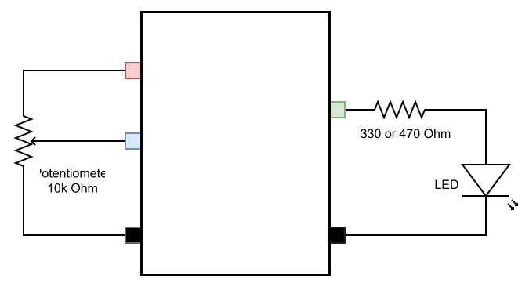

# ใบงานการทดลองที่ 10.1 (Lab 10.1)
### การพัฒนาระบบค้นหาอุปกรณ์ด้วย mDNS และเว็บเซิร์ฟเวอร์ควบคุมอุปกรณ์ผ่าน HTTP RESTful API บน ESP-IDF

> [!NOTE] **คำชี้แจง**
> ในใบงานนี้ นักศึกษาจะได้เรียนรู้การสร้างระบบ Local Control ด้วยการเปลี่ยนบอร์ด ESP32 ให้กลายเป็น **HTTP RESTful Web Server** โดยใช้คอมโพเนนต์ทางการของ ESP-IDF (`esp_http_server`) พร้อมทั้งติดตั้งระบบค้นหาชื่อโดเมนเสมือน **mDNS (Multicast DNS)** เพื่อให้คอมพิวเตอร์และโทรศัพท์มือถือสามารถเข้าถึง ESP32 ได้ผ่านชื่อ `http://esp32-node.local` โดยไม่ต้องจำหมายเลข IP

---

## 1. วัตถุประสงค์การทดลอง
1. เข้าใจกลไกการเชื่อมต่อเครือข่าย Wi-Fi ในโหมด Station (STA) ด้วยสแตก LwIP บน ESP-IDF
2. สามารถเปิดใช้งานและตั้งค่า mDNS Service Discovery เพื่อประกาศชื่อโฮสต์และบริการ HTTP ได้
3. สามารถพัฒนา RESTful API Endpoints (`GET /api/status` และ `POST /api/led`) ด้วยคอมโพเนนต์ `esp_http_server` ได้
4. สามารถประมวลผลข้อมูล JSON Payload (Parsing & Serialization) ด้วยไลบรารี `cJSON` ได้อย่างปลอดภัย
5. สามารถทดสอบส่งคำสั่งควบคุม LED (GPIO 2) และอ่านค่า Potentiometer (GPIO 34) ผ่านโปรแกรม `cURL` และสคริปต์ Python ได้

---

## 2. วงจรและการต่อสายฮาร์ดแวร์ (Schematic & Wiring)
<p align="center">
 
</p>
<p align="center">
<b> รูปที่ L10-1 </b> แผนภาพการต่อสาย ESP32 เข้ากับ LED (GPIO 2) และ Potentiometer (GPIO 34)
</p>

| อุปกรณ์                    | ขาอุปกรณ์      | ขาต่อบน ESP32  | หน้าที่                                 |
| :------------------------- | :------------- | :------------- | :-------------------------------------- |
| **Onboard / External LED** | ขาบวก (Anode)  | **GPIO 2**     | หลอดไฟแสดงสถานะการควบคุม Output         |
| **Potentiometer (10k)**    | ขากลาง (Wiper) | **GPIO 34**    | เซนเซอร์แอนะล็อกอินพุต (ADC1 Channel 6) |
| **Potentiometer (10k)**    | ขาซ้าย/ขวา     | **3.3V / GND** | แรงดันไฟเลี้ยงและกราวด์                 |

---

## 3. ขั้นตอนการทดลอง (Deconstructed Activities)

### กิจกรรมที่ 1.1 การสร้างโปรเจกต์ใหม่และตั้งค่าโครงสร้าง Dependency

#### 1. สร้างโปรเจกต์ใหม่
สร้างโฟลเดอร์โปรเจกต์ผ่านคำสั่ง ESP-IDF

```powershell
idf.py create-project Lab10-1_HTTP_REST_Server
cd Lab10-1_HTTP_REST_Server
```

**หรือรันผ่าน Docker**
```powershell
# รันคำสั่งสร้างโปรเจกต์ Lab10-1_HTTP_REST_Server ในโฟลเดอร์ปัจจุบัน
docker run --rm --mount "type=bind,source=$((Get-Location).Path),target=/workspace" -w /workspace espressif/idf:release-v6.1 idf.py create-project Lab10-1_HTTP_REST_Server

# เข้าสู่ไดเรกทอรีโปรเจกต์
cd Lab10-1_HTTP_REST_Server
```

#### 2. กำหนด Target เป็นชิป ESP32
```powershell
idf.py set-target esp32
```

**หรือรันผ่าน Docker (ต้อง cd เข้าไปใน  `Lab10-1_HTTP_REST_Server` ก่อนรันคำสั่ง)**
```powershell
docker run --rm --mount "type=bind,source=$((Get-Location).Path),target=/workspace" -w /workspace espressif/idf:release-v6.1 idf.py set-target esp32
```

#### 3. การเพิ่ม Dependency: `mdns` และ `cjson` (IDF Component Manager)

> [!IMPORTANT] **ข้อควรทราบสำคัญสำหรับ ESP-IDF v5.x และ v6.x**
> ใน ESP-IDF เวอร์ชัน 5.0 ขึ้นไป คอมโพเนนต์ **`mdns`** และ **`cJSON`** ถูกแยกออกจากคอร์หลักของ ESP-IDF ย้ายไปยัง **IDF Component Registry** (`https://components.espressif.com`) 
> หากระบุ `REQUIRES mdns` หรือ `REQUIRES json` โดยตรงใน `CMakeLists.txt` ระบบจะแจ้งเตือนความผิดพลาดต่อไปนี้
> ```text
> HINT: The component 'mdns' could not be found... 
> component has been moved to the IDF component manager
> ```
> จึงจำเป็นต้องลงทะเบียน Dependency ผ่าน Component Manager ก่อนเสมอ

เพิ่มคอมโพเนนต์ `espressif/mdns` และ `espressif/cjson` เข้าโปรเจกต์ โดยรันคำสั่งต่อไปนี้

```powershell
idf.py add-dependency "espressif/mdns"
idf.py add-dependency "espressif/cjson"
```

**หรือรันผ่าน Docker (จากภายในโฟลเดอร์โปรเจกต์):**
```powershell
docker run --rm --mount "type=bind,source=$((Get-Location).Path),target=/workspace" -w /workspace espressif/idf:release-v6.1 idf.py add-dependency "espressif/mdns"
docker run --rm --mount "type=bind,source=$((Get-Location).Path),target=/workspace" -w /workspace espressif/idf:release-v6.1 idf.py add-dependency "espressif/cjson"
```

คำสั่ง add-dependency จะไปแก้ไขไฟล์ `idf_component.yml` ใน main และถ้ายังไม่มีไฟล์ดังกล่าว idf จะสร้างไฟล์ดังกล่าวให้โดยอัตโนมัติ
ผลลัพธ์ที่ได้จะมีหน้าตาคล้ายดังนี้
```yaml
dependencies:
  idf:
    version: "~6.0.0"
  espressif/mdns:
    version: "~3.1.0"
  espressif/cjson:
    version: "~1.8.1"  
```

*ถ้าไม่อยากรันสองคำสั่งด้านบน ให่สร้าง/ตรวจสอบไฟล์ `main/idf_component.yml` ให้มีเนื้อหาดังนี้*
```yaml
dependencies:
  idf:
    version: '>=4.1.0'
  espressif/mdns: '*'
  espressif/cjson: '*'
```

#### 4. ตั้งค่า `main/CMakeLists.txt`
เปิดไฟล์ `main/CMakeLists.txt` และตรวจสอบว่าได้เรียกใช้คอมโพเนนต์ที่จำเป็นครบถ้วน:

```cmake
idf_component_register(SRCS "Lab10-1_HTTP_REST_Server.c"
                       INCLUDE_DIRS "."
                       REQUIRES esp_http_server mdns esp_wifi esp_event nvs_flash cjson esp_adc)
```
*(หมายเหตุ: ใน ESP-IDF v6.x ให้ใช้ `cjson` แทน `json` และตรวจดูชื่อไฟล์ใน `SRCS` ให้ตรงกับไฟล์โค้ดจริงในโฟลเดอร์ `main`)*

#### 5. ทดสอบ Reconfigure ระบบบิลด์
ทดสอบรันคำสั่ง Reconfigure เพื่อให้ระบบดาวน์โหลดคอมโพเนนต์และสร้างบิลด์ไฟล์:
```powershell
idf.py reconfigure
```

**หรือรันผ่าน Docker:**
```powershell
docker run --rm --mount "type=bind,source=$((Get-Location).Path),target=/workspace" -w /workspace espressif/idf:release-v6.1 idf.py reconfigure
```
เมื่อปรากฏข้อความ `-- Configuring done` และ `-- Generating done` แสดงว่าโครงสร้างโปรเจกต์พร้อมสำหรับการเขียนโค้ดในกิจกรรมถัดไป


---

### กิจกรรมที่ 1.2 การติดตั้งและเปิดใช้งานบริการ mDNS
ในไฟล์ `main/main.c` เขียนฟังก์ชันสำหรับเริ่มต้นระบบ mDNS

```c
#include "mdns.h"

static void initialise_mdns(void)
{
    // กำหนดค่าเริ่มต้นให้กับ mDNS
    ESP_ERROR_CHECK(mdns_init());
    
    // กำหนดชื่อโฮสต์สำหรับเข้าถึง: http://esp32-node.local
    ESP_ERROR_CHECK(mdns_hostname_set("esp32-node"));
    ESP_ERROR_CHECK(mdns_instance_name_set("ESP32 RESTful Controller"));

    // ประกาศบริการ HTTP พอร์ต 80
    mdns_txt_item_t serviceTxtData[] = {
        {"board", "esp32"},
        {"role", "actuator"}
    };
    ESP_ERROR_CHECK(mdns_service_add("ESP32-WebControl", "_http", "_tcp", 80, serviceTxtData, 2));
    ESP_LOGI("mDNS", "mDNS initialized! Hostname: esp32-node.local");
}
```

---

### กิจกรรมที่ 1.3: การพัฒนา REST API Endpoints บน `esp_http_server`
เขียนฟังก์ชัน Handler สำหรับรองรับคำสั่ง **GET** และ **POST**:

```c
#include <esp_http_server.h>
#include "cJSON.h"

// 1. GET /api/status - อ่านค่าเซนเซอร์และสถานะระบบ
static esp_err_t status_get_handler(httpd_req_t *req)
{
    cJSON *root = cJSON_CreateObject();
    cJSON_AddNumberToObject(root, "pot_raw", 2048); // แทนที่ด้วยฟังก์ชันอ่าน ADC จาก GPIO 34
    cJSON_AddNumberToObject(root, "free_heap", esp_get_free_heap_size());
    cJSON_AddBoolToObject(root, "led", gpio_get_level(GPIO_NUM_2));

    const char *resp = cJSON_PrintUnformatted(root);
    httpd_resp_set_type(req, "application/json");
    httpd_resp_send(req, resp, strlen(resp));

    cJSON_free((void *)resp);
    cJSON_Delete(root);
    return ESP_OK;
}

// 2. POST /api/led - ควบคุมหลอดไฟ LED
static esp_err_t led_post_handler(httpd_req_t *req)
{
    char buf[128];
    int ret = httpd_req_recv(req, buf, sizeof(buf) - 1);
    if (ret <= 0) {
        httpd_resp_send_500(req);
        return ESP_FAIL;
    }
    buf[ret] = '\0';

    cJSON *root = cJSON_Parse(buf);
    if (root != NULL) {
        cJSON *state = cJSON_GetObjectItem(root, "state");
        if (cJSON_IsBool(state)) {
            bool led_on = cJSON_IsTrue(state);
            gpio_set_level(GPIO_NUM_2, led_on ? 1 : 0);
            ESP_LOGI("HTTP", "LED switched to: %d", led_on);
        }
        cJSON_Delete(root);
    }

    const char *resp = "{\"result\":\"success\"}";
    httpd_resp_set_type(req, "application/json");
    httpd_resp_send(req, resp, strlen(resp));
    return ESP_OK;
}
```

---

### กิจกรรมที่ 1.4: การทดสอบและตรวจพิสูจน์ (Verification & Forensics)

#### 1. ตรวจสอบ mDNS ด้วยคำสั่ง ping
เปิด Terminal บนเครื่องคอมพิวเตอร์ที่อยู่ในวง Wi-Fi เดียวกัน:
```powershell
ping esp32-node.local
```
*(บันทึกภาพผลการ Ping และหมายเลข IP ที่ Resolve ได้)*

#### 2. ทดสอบอ่านค่าเซนเซอร์ผ่าน cURL
```powershell
curl -X GET http://esp32-node.local/api/status
```

#### 3. ทดสอบสั่งเปิด-ปิด LED ผ่าน cURL
```powershell
# สั่งเปิดไฟ LED
curl -X POST http://esp32-node.local/api/led -H "Content-Type: application/json" -d "{\"state\": true}"

# สั่งปิดไฟ LED
curl -X POST http://esp32-node.local/api/led -H "Content-Type: application/json" -d "{\"state\": false}"
```

---

## 4. บันทึกผลการทดลองและคำถามท้ายบท (Lab Report & Questions)
1. นำผลการรัน `curl -i` (โหมด verbose เพื่อดู HTTP Response Header) มาแปะในรายงาน พร้อมวิเคราะห์ว่า HTTP Header มีขนาดกี่ไบต์ และข้อมูล JSON มีขนาดกี่ไบต์
2. หากในเครือข่ายมีคอมพิวเตอร์ที่ไม่รองรับ mDNS หรือปิดกั้นพอร์ต UDP 5353 จะเกิดผลกระทบอย่างไร และแก้ไขได้อย่างไร?
3. เหตุใดจึงต้องเรียกคำสั่ง `cJSON_Delete(root)` และ `cJSON_free(resp)` เสมอหลังจากประมวลผลเสร็จสิ้น?
