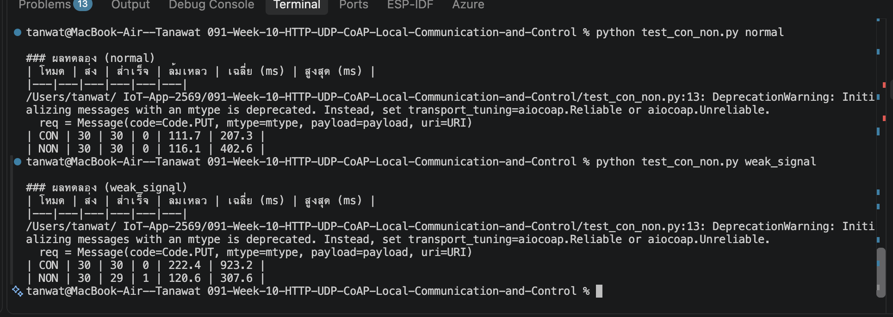

# ใบงานการทดลองที่ 10.3
### การพัฒนา CoAP Server สำหรับระบบฝังตัวและการควบคุมอุปกรณ์ด้วยโปรโตคอลน้ำหนักเบา

> [!NOTE] **คำชี้แจง**
> ในใบงานนี้ นักศึกษาจะได้เรียนรู้การติดตั้งและพัฒนาเซิร์ฟเวอร์ด้วยโปรโตคอล **CoAP (Constrained Application Protocol - RFC 7252)** บน ESP32 ซึ่งเป็นโปรโตคอลมาตรฐานสากลสำหรับอุปกรณ์ IoT ที่รวมข้อดีด้านความเบาของ UDP เข้ากับสถาปัตยกรรม RESTful ของ HTTP พร้อมทั้งทดสอบคุณสมบัติ **Observe (RFC 7641)** เพื่อติดตามค่าเซนเซอร์โดยอัตโนมัติ

---

## 1. วัตถุประสงค์การทดลอง
1. เข้าใจโครงสร้างของ CoAP Packet และการทำงานของ CoAP Endpoints (Resources)
2. สามารถพัฒนา CoAP Server บน ESP-IDF เพื่อเปิดให้บริการ Resource `/actuator/led` และ `/sensor/pot` บนพอร์ต UDP 5683 ได้
3. สามารถทดสอบส่งคำสั่ง CoAP แบบ **Confirmable (CON)** และ **Non-confirmable (NON)** ได้
4. สามารถทดสอบกลไก **Resource Discovery (`/.well-known/core`)** เพื่อค้นหารายการทรัพยากรบน ESP32 ได้
5. สามารถเขียนสคริปต์ Python ด้วยไลบรารี `aiocoap` เพื่อทดลองใช้งานฟีเจอร์ **CoAP Observe** ในการรับข้อมูลเซนเซอร์แบบ Real-time Event-driven

---

## 2. โครงสร้างการแมป CoAP Endpoints

| Resource URI        | Method | คำอธิบาย                           |   ชนิด Payload   | ตัวอย่างคำสั่ง CoAP Client                                       |
| :------------------ | :----: | :--------------------------------- | :--------------: | :--------------------------------------------------------------- |
| `/.well-known/core` |  GET   | แสดงรายการ Resource ทั้งหมดของโหนด | CoRE Link Format | `coap-client -m get coap://esp32-node.local/.well-known/core`    |
| `/sensor/pot`       |  GET   | อ่านค่าอนาล็อก Potentiometer       |   Text / JSON    | `coap-client -m get coap://esp32-node.local/sensor/pot`          |
| `/actuator/led`     |  PUT   | สั่งเปิด/ปิดไฟ LED (1 หรือ 0)      |  Text (`1`/`0`)  | `coap-client -m put -e "1" coap://esp32-node.local/actuator/led` |

---

## 3. ขั้นตอนการทดลอง

### กิจกรรมที่ 10-3.1 สร้างโปรเจกต์และเพิ่ม CoAP Component

#### 1. สร้างโปรเจกต์ใหม่
```powershell
idf.py create-project Lab10-3_CoAP_Server
cd Lab10-3_CoAP_Server
```

**หรือรันผ่าน Docker**
```powershell
docker run --rm --mount "type=bind,source=$((Get-Location).Path),target=/workspace" -w /workspace espressif/idf:release-v6.1 idf.py create-project Lab10-3_CoAP_Server
cd Lab10-3_CoAP_Server
```

#### 2. กำหนด Target เป็นชิป ESP32
```powershell
idf.py set-target esp32
```

**หรือรันผ่าน Docker**
```powershell
docker run --rm --mount "type=bind,source=$((Get-Location).Path),target=/workspace" -w /workspace espressif/idf:release-v6.1 idf.py set-target esp32
```

#### 3. การเพิ่ม Dependency  `espressif/coap` (IDF Component Manager)
ใน ESP-IDF v5/v6 ไลบรารี `libcoap` ถูกย้ายไปอยู่บน Component Registry จึงต้องลงทะเบียน dependency ก่อนเสมอ

```powershell
idf.py add-dependency "espressif/coap"
```

**หรือรันผ่าน Docker**
```powershell
# รันผ่าน Docker จากโฟลเดอร์โปรเจกต์ Lab10-3_CoAP_Server
docker run --rm --mount "type=bind,source=$((Get-Location).Path),target=/workspace" -w /workspace espressif/idf:release-v6.1 idf.py add-dependency "espressif/coap"
```

*(หรือสร้าง/ตรวจสอบไฟล์ `main/idf_component.yml` ให้มีเนื้อหาดังนี้)*
```yaml
dependencies:
  idf:
    version: '>=4.1.0'
  espressif/coap: '*'
```

#### 4. ตั้งค่า `main/CMakeLists.txt`
```cmake
idf_component_register(SRCS "Lab10-3_CoAP_Server.c"
                       INCLUDE_DIRS "."
                       REQUIRES esp_wifi esp_event nvs_flash coap esp_adc esp_driver_gpio)
```

#### 5. สร้างไฟล์ `sdkconfig.defaults` เพื่อเปิดใช้ฟีเจอร์ DTLS Cookie ใน mbedTLS
> [!IMPORTANT] **ข้อกำหนดสำคัญสำหรับ `espressif/coap`**
> ไลบรารี `libcoap` มีการเรียกใช้ฟังก์ชัน DTLS cookie (`mbedtls_ssl_cookie_*`) ซึ่งค่าเริ่มต้นของ ESP-IDF จะปิดใช้งาน DTLS ไว้ หากไม่เปิดใช้งานจะเกิด Linker Error (`undefined reference to mbedtls_ssl_cookie_init`)
>
> ให้สร้างไฟล์ `sdkconfig.defaults` ในโฟลเดอร์หลักของโปรเจกต์ `Lab10-3_CoAP_Server/`
> ```ini
> CONFIG_MBEDTLS_SSL_PROTO_DTLS=y
> CONFIG_MBEDTLS_SSL_COOKIE_C=y
> ```

#### 6. ทดสอบ Reconfigure ระบบบิลด์
ทดสอบรันคำสั่ง Reconfigure เพื่อให้ระบบดาวน์โหลดคอมโพเนนต์และสร้างบิลด์ไฟล์
```powershell
idf.py reconfigure
```

**หรือรันผ่าน Docker**
```powershell
docker run --rm --mount "type=bind,source=$((Get-Location).Path),target=/workspace" -w /workspace espressif/idf:release-v6.1 idf.py reconfigure
```

เมื่อปรากฏข้อความ `-- Configuring done` และ `-- Generating done` แสดงว่าโครงสร้างโปรเจกต์พร้อมสำหรับการเขียนโค้ดในกิจกรรมถัดไป

---

### กิจกรรมที่ 10-3.2 การพัฒนา Handlers สำหรับ Resource `/sensor/pot` และ `/actuator/led`
เขียนฟังก์ชัน Callback สำหรับจัดการคำขออ่านค่าเซนเซอร์ (GET) และสั่งงานควบคุม LED (PUT)

```c
#include "coap3/coap.h"

// 1. Handler สำหรับ GET /sensor/pot
static void hnd_get_pot(coap_resource_t *resource,
                        coap_session_t *session,
                        const coap_pdu_t *request,
                        const coap_string_t *query,
                        coap_pdu_t *response)
{
    int pot_val = 0;
    if (s_adc1_handle != NULL) {
        adc_oneshot_read(s_adc1_handle, POT_ADC_CHANNEL, &pot_val);
    }

    char pot_str[32];
    snprintf(pot_str, sizeof(pot_str), "%d", pot_val);

    coap_pdu_set_code(response, COAP_RESPONSE_CODE_CONTENT); // 2.05 Content
    coap_add_data(response, strlen(pot_str), (const uint8_t *)pot_str);
    ESP_LOGI("CoAP", "Responded GET /sensor/pot: %s", pot_str);
}

// 2. Handler สำหรับ PUT /actuator/led
static void hnd_put_led(coap_resource_t *resource,
                        coap_session_t *session,
                        const coap_pdu_t *request,
                        const coap_string_t *query,
                        coap_pdu_t *response)
{
    size_t size;
    const uint8_t *data;
    coap_get_data(request, &size, &data);

    if (size > 0) {
        if (data[0] == '1') {
            gpio_set_level(LED_GPIO_PIN, 1);
            ESP_LOGI("CoAP", "LED turned ON via CoAP PUT");
        } else if (data[0] == '0') {
            gpio_set_level(LED_GPIO_PIN, 0);
            ESP_LOGI("CoAP", "LED turned OFF via CoAP PUT");
        }
    }
    coap_pdu_set_code(response, COAP_RESPONSE_CODE_CHANGED); // 2.04 Changed
}
```

---

### กิจกรรมที่ 10-3.3 การพัฒนา CoAP Server FreeRTOS Task
สร้าง Task สำหรับเริ่มต้น CoAP Context, ลงทะเบียน Resources, และวนลูปประมวลผล Event Loop ด้วย `coap_io_process()`

```c
static void coap_server_task(void *pvParameters)
{
    coap_context_t *ctx = NULL;
    coap_address_t serv_addr;

    while (1) {
        coap_address_init(&serv_addr);
        serv_addr.addr.sin.sin_family = AF_INET;
        serv_addr.addr.sin.sin_addr.s_addr = htonl(INADDR_ANY);
        serv_addr.addr.sin.sin_port = htons(COAP_DEFAULT_PORT); // 5683

        ctx = coap_new_context(NULL);
        if (!ctx) {
            ESP_LOGE("CoAP", "coap_new_context() failed");
            vTaskDelay(pdMS_TO_TICKS(1000));
            continue;
        }

        coap_endpoint_t *ep = coap_new_endpoint(ctx, &serv_addr, COAP_PROTO_UDP);
        if (!ep) {
            ESP_LOGE("CoAP", "coap_new_endpoint() failed");
            coap_free_context(ctx);
            vTaskDelay(pdMS_TO_TICKS(1000));
            continue;
        }

        // 1. ลงทะเบียน Resource: sensor/pot (GET)
        coap_str_const_t *r_pot_uri = coap_make_str_const("sensor/pot");
        coap_resource_t *r_pot = coap_resource_init(r_pot_uri, 0);
        coap_register_handler(r_pot, COAP_REQUEST_GET, hnd_get_pot);
        coap_add_resource(ctx, r_pot);

        // 2. ลงทะเบียน Resource: actuator/led (PUT)
        coap_str_const_t *r_led_uri = coap_make_str_const("actuator/led");
        coap_resource_t *r_led = coap_resource_init(r_led_uri, 0);
        coap_register_handler(r_led, COAP_REQUEST_PUT, hnd_put_led);
        coap_add_resource(ctx, r_led);

        ESP_LOGI("CoAP", "CoAP Server started on port %d!", COAP_DEFAULT_PORT);

        // วนลูปประมวลผล I/O ของ CoAP
        while (1) {
            coap_io_process(ctx, 100);
        }

        coap_free_context(ctx);
    }
    vTaskDelete(NULL);
}
```

---

### กิจกรรมที่ 10-3.4 การเชื่อมโยงระบบ Wi-Fi และฟังก์ชัน `app_main(void)`

ในกิจกรรมนี้ จะเป็นการประกอบระบบทั้งหมดเข้าด้วยกัน โดยมีขั้นตอนสำคัญใน `app_main()` ดังนี้
1. เริ่มต้นระบบหน่วยความจำแฟลช **NVS (Non-Volatile Storage)** ซึ่งจำเป็นสำหรับโมดูล Wi-Fi Driver
2. เริ่มต้น **LwIP TCP/IP Stack** และ **Default Event Loop**
3. กำหนดค่าฮาร์ดแวร์ **GPIO 2 (LED)** เป็นโหมด Input/Output และ **ADC1 Channel 6 (GPIO 34)** สำหรับอ่านค่า Potentiometer
4. เชื่อมต่อเครือข่าย Wi-Fi ในโหมด **Station (STA)** ไปยัง Access Point
5. เมื่อเชื่อมต่อ Wi-Fi และได้รับหมายเลข IP สำเร็จ ให้สร้าง FreeRTOS Task เพื่อรัน **`coap_server_task`** (กำหนด Stack Size ขนาดอย่างน้อย `8192` ไบต์ เพื่อรองรับการทำงานของ `libcoap`)

#### 1. ฟังก์ชันเชื่อมต่อ Wi-Fi Station (`wifi_init_sta`)
```c
static bool wifi_init_sta(void)
{
    s_wifi_event_group = xEventGroupCreate();

    esp_netif_create_default_wifi_sta();

    wifi_init_config_t cfg = WIFI_INIT_CONFIG_DEFAULT();
    ESP_ERROR_CHECK(esp_wifi_init(&cfg));

    ESP_ERROR_CHECK(esp_event_handler_instance_register(WIFI_EVENT, ESP_EVENT_ANY_ID, &wifi_event_handler, NULL, NULL));
    ESP_ERROR_CHECK(esp_event_handler_instance_register(IP_EVENT, IP_EVENT_STA_GOT_IP, &wifi_event_handler, NULL, NULL));

    wifi_config_t wifi_config = {
        .sta = {
            .threshold.authmode = WIFI_AUTH_WPA2_PSK,
        },
    };
    size_t ssid_len = strlen(CONFIG_WIFI_SSID);
    if (ssid_len > sizeof(wifi_config.sta.ssid)) ssid_len = sizeof(wifi_config.sta.ssid);
    memcpy(wifi_config.sta.ssid, CONFIG_WIFI_SSID, ssid_len);

    size_t pass_len = strlen(CONFIG_WIFI_PASSWORD);
    if (pass_len > sizeof(wifi_config.sta.password)) pass_len = sizeof(wifi_config.sta.password);
    memcpy(wifi_config.sta.password, CONFIG_WIFI_PASSWORD, pass_len);

    ESP_ERROR_CHECK(esp_wifi_set_mode(WIFI_MODE_STA));
    ESP_ERROR_CHECK(esp_wifi_set_config(WIFI_IF_STA, &wifi_config));
    ESP_ERROR_CHECK(esp_wifi_start());

    ESP_LOGI(TAG, "Connecting to AP: %s...", CONFIG_WIFI_SSID);

    EventBits_t bits = xEventGroupWaitBits(s_wifi_event_group, WIFI_CONNECTED_BIT | WIFI_FAIL_BIT, pdFALSE, pdFALSE, portMAX_DELAY);
    return (bits & WIFI_CONNECTED_BIT) != 0;
}
```

#### 2. ฟังก์ชันหลัก `app_main(void)`
```c
void app_main(void)
{
    // 1. Initialise NVS Flash
    esp_err_t ret = nvs_flash_init();
    if (ret == ESP_ERR_NVS_NO_FREE_PAGES || ret == ESP_ERR_NVS_NEW_VERSION_FOUND) {
        ESP_ERROR_CHECK(nvs_flash_erase());
        ret = nvs_flash_init();
    }
    ESP_ERROR_CHECK(ret);

    // 2. Netif & Event Loop
    ESP_ERROR_CHECK(esp_netif_init());
    ESP_ERROR_CHECK(esp_event_loop_create_default());

    // 3. Setup Hardware (LED & ADC)
    gpio_reset_pin(LED_GPIO_PIN);
    gpio_set_direction(LED_GPIO_PIN, GPIO_MODE_INPUT_OUTPUT);

    adc_oneshot_unit_init_cfg_t init_config1 = { .unit_id = ADC_UNIT_1 };
    if (adc_oneshot_new_unit(&init_config1, &s_adc1_handle) == ESP_OK) {
        adc_oneshot_chan_cfg_t chan_config = {
            .bitwidth = ADC_BITWIDTH_DEFAULT,
            .atten = ADC_ATTEN_DB_12,
        };
        adc_oneshot_config_channel(s_adc1_handle, POT_ADC_CHANNEL, &chan_config);
        ESP_LOGI(TAG, "ADC Initialized on GPIO 34");
    }

    // 4. Connect Wi-Fi
    if (wifi_init_sta()) {
        // 5. Create CoAP Server Task (Stack size 8192 ไบต์)
        xTaskCreate(coap_server_task, "coap_server", 8192, NULL, 5, NULL);
        ESP_LOGI(TAG, "Ready! Test CoAP with: python test_coap.py");
    } else {
        ESP_LOGE(TAG, "Wi-Fi connection failed.");
    }
}
```

### ตารางสรุป Header Files และหน้าที่การทำงาน

| Header file | หน้าที่และขอบเขตการใช้งานในแล็บนี้ |
| :--- | :--- |
| `stdio.h` / `string.h` | จัดการ Input/Output และสตริง (`snprintf()`, `strlen()`, `memcpy()`) |
| `esp_log.h` | ส่งข้อความ Logging สถานะของระบบ (`ESP_LOGI()`, `ESP_LOGE()`) |
| `nvs_flash.h` | จัดการ Non-Volatile Storage สำหรับระบบ Wi-Fi |
| `esp_netif.h` / `esp_event.h` | จัดการ TCP/IP Network Interface และ Default Event Loop |
| `esp_wifi.h` | จัดการการเชื่อมต่อวิทยุ Wi-Fi Station |
| `freertos/FreeRTOS.h` / `task.h` | จัดการ FreeRTOS Tasks สำหรับรัน CoAP Server Task (`xTaskCreate()`) |
| `coap3/coap.h` | ไลบรารีทางการของ CoAP (libcoap v4.3) สำหรับสร้าง Context, Resources, และ PDU |
| `driver/gpio.h` | ควบคุมขาหลอดไฟ LED (GPIO 2) |
| `esp_adc/adc_oneshot.h` | อ่านค่าแรงดันแอนะล็อกจาก Potentiometer (GPIO 34 / ADC1 Channel 6) |

<details>
<summary><b>🔍 คลิกดูซอร์สโค้ดฉบับสมบูรณ์ทั้งไฟล์ (Lab10-3_CoAP_Server.c)</b></summary>

```c
#include <stdio.h>
#include <string.h>
#include "esp_log.h"
#include "nvs_flash.h"
#include "esp_netif.h"
#include "esp_event.h"
#include "esp_wifi.h"
#include "freertos/FreeRTOS.h"
#include "freertos/task.h"
#include "freertos/event_groups.h"
#include "coap3/coap.h"
#include "driver/gpio.h"
#include "esp_adc/adc_oneshot.h"

#define TAG "COAP_LAB"

// กำหนดชื่อและรหัสผ่าน Wi-Fi
#define CONFIG_WIFI_SSID      "YOUR_WIFI_SSID"
#define CONFIG_WIFI_PASSWORD  "YOUR_WIFI_PASSWORD"
#define MAXIMUM_RETRY         5

#define LED_GPIO_PIN          GPIO_NUM_2
#define POT_ADC_CHANNEL       ADC_CHANNEL_6 // GPIO 34 (ADC1 Channel 6)

static EventGroupHandle_t s_wifi_event_group;
#define WIFI_CONNECTED_BIT    BIT0
#define WIFI_FAIL_BIT         BIT1

static int s_retry_num = 0;
static adc_oneshot_unit_handle_t s_adc1_handle = NULL;

static void wifi_event_handler(void* arg, esp_event_base_t event_base,
                               int32_t event_id, void* event_data)
{
    if (event_base == WIFI_EVENT && event_id == WIFI_EVENT_STA_START) {
        esp_wifi_connect();
    } else if (event_base == WIFI_EVENT && event_id == WIFI_EVENT_STA_DISCONNECTED) {
        if (s_retry_num < MAXIMUM_RETRY) {
            esp_wifi_connect();
            s_retry_num++;
            ESP_LOGI(TAG, "Retrying Wi-Fi (%d/%d)...", s_retry_num, MAXIMUM_RETRY);
        } else {
            xEventGroupSetBits(s_wifi_event_group, WIFI_FAIL_BIT);
        }
    } else if (event_base == IP_EVENT && event_id == IP_EVENT_STA_GOT_IP) {
        ip_event_got_ip_t* event = (ip_event_got_ip_t*) event_data;
        ESP_LOGI(TAG, "Connected! IP Address: " IPSTR, IP2STR(&event->ip_info.ip));
        s_retry_num = 0;
        xEventGroupSetBits(s_wifi_event_group, WIFI_CONNECTED_BIT);
    }
}

static bool wifi_init_sta(void)
{
    s_wifi_event_group = xEventGroupCreate();

    esp_netif_create_default_wifi_sta();

    wifi_init_config_t cfg = WIFI_INIT_CONFIG_DEFAULT();
    ESP_ERROR_CHECK(esp_wifi_init(&cfg));

    ESP_ERROR_CHECK(esp_event_handler_instance_register(WIFI_EVENT, ESP_EVENT_ANY_ID, &wifi_event_handler, NULL, NULL));
    ESP_ERROR_CHECK(esp_event_handler_instance_register(IP_EVENT, IP_EVENT_STA_GOT_IP, &wifi_event_handler, NULL, NULL));

    wifi_config_t wifi_config = {
        .sta = {
            .threshold.authmode = WIFI_AUTH_WPA2_PSK,
        },
    };
    size_t ssid_len = strlen(CONFIG_WIFI_SSID);
    if (ssid_len > sizeof(wifi_config.sta.ssid)) ssid_len = sizeof(wifi_config.sta.ssid);
    memcpy(wifi_config.sta.ssid, CONFIG_WIFI_SSID, ssid_len);

    size_t pass_len = strlen(CONFIG_WIFI_PASSWORD);
    if (pass_len > sizeof(wifi_config.sta.password)) pass_len = sizeof(wifi_config.sta.password);
    memcpy(wifi_config.sta.password, CONFIG_WIFI_PASSWORD, pass_len);

    ESP_ERROR_CHECK(esp_wifi_set_mode(WIFI_MODE_STA));
    ESP_ERROR_CHECK(esp_wifi_set_config(WIFI_IF_STA, &wifi_config));
    ESP_ERROR_CHECK(esp_wifi_start());

    ESP_LOGI(TAG, "Connecting to AP: %s...", CONFIG_WIFI_SSID);

    EventBits_t bits = xEventGroupWaitBits(s_wifi_event_group, WIFI_CONNECTED_BIT | WIFI_FAIL_BIT, pdFALSE, pdFALSE, portMAX_DELAY);
    return (bits & WIFI_CONNECTED_BIT) != 0;
}

// 1. Handler สำหรับ GET /sensor/pot
static void hnd_get_pot(coap_resource_t *resource,
                        coap_session_t *session,
                        const coap_pdu_t *request,
                        const coap_string_t *query,
                        coap_pdu_t *response)
{
    int pot_val = 0;
    if (s_adc1_handle != NULL) {
        adc_oneshot_read(s_adc1_handle, POT_ADC_CHANNEL, &pot_val);
    }

    char pot_str[32];
    snprintf(pot_str, sizeof(pot_str), "%d", pot_val);

    coap_pdu_set_code(response, COAP_RESPONSE_CODE_CONTENT); // 2.05 Content
    coap_add_data(response, strlen(pot_str), (const uint8_t *)pot_str);
    ESP_LOGI(TAG, "GET /sensor/pot -> %s", pot_str);
}

// 2. Handler สำหรับ PUT /actuator/led
static void hnd_put_led(coap_resource_t *resource,
                        coap_session_t *session,
                        const coap_pdu_t *request,
                        const coap_string_t *query,
                        coap_pdu_t *response)
{
    size_t size;
    const uint8_t *data;
    coap_get_data(request, &size, &data);

    if (size > 0) {
        if (data[0] == '1') {
            gpio_set_level(LED_GPIO_PIN, 1);
            ESP_LOGI(TAG, "LED turned ON via CoAP PUT");
        } else if (data[0] == '0') {
            gpio_set_level(LED_GPIO_PIN, 0);
            ESP_LOGI(TAG, "LED turned OFF via CoAP PUT");
        }
    }
    coap_pdu_set_code(response, COAP_RESPONSE_CODE_CHANGED); // 2.04 Changed
}

// CoAP Server Task
static void coap_server_task(void *pvParameters)
{
    coap_context_t *ctx = NULL;
    coap_address_t serv_addr;

    while (1) {
        coap_address_init(&serv_addr);
        serv_addr.addr.sin.sin_family = AF_INET;
        serv_addr.addr.sin.sin_addr.s_addr = htonl(INADDR_ANY);
        serv_addr.addr.sin.sin_port = htons(COAP_DEFAULT_PORT);

        ctx = coap_new_context(NULL);
        if (!ctx) {
            ESP_LOGE(TAG, "coap_new_context() failed");
            vTaskDelay(pdMS_TO_TICKS(1000));
            continue;
        }

        coap_endpoint_t *ep = coap_new_endpoint(ctx, &serv_addr, COAP_PROTO_UDP);
        if (!ep) {
            ESP_LOGE(TAG, "coap_new_endpoint() failed");
            coap_free_context(ctx);
            vTaskDelay(pdMS_TO_TICKS(1000));
            continue;
        }

        // ลงทะเบียน Resources
        coap_str_const_t *r_pot_uri = coap_make_str_const("sensor/pot");
        coap_resource_t *r_pot = coap_resource_init(r_pot_uri, 0);
        coap_register_handler(r_pot, COAP_REQUEST_GET, hnd_get_pot);
        coap_add_resource(ctx, r_pot);

        coap_str_const_t *r_led_uri = coap_make_str_const("actuator/led");
        coap_resource_t *r_led = coap_resource_init(r_led_uri, 0);
        coap_register_handler(r_led, COAP_REQUEST_PUT, hnd_put_led);
        coap_add_resource(ctx, r_led);

        ESP_LOGI(TAG, "CoAP Server listening on port %d...", COAP_DEFAULT_PORT);

        while (1) {
            coap_io_process(ctx, 100);
        }

        coap_free_context(ctx);
    }
    vTaskDelete(NULL);
}

void app_main(void)
{
    // 1. Initialise NVS
    esp_err_t ret = nvs_flash_init();
    if (ret == ESP_ERR_NVS_NO_FREE_PAGES || ret == ESP_ERR_NVS_NEW_VERSION_FOUND) {
        ESP_ERROR_CHECK(nvs_flash_erase());
        ret = nvs_flash_init();
    }
    ESP_ERROR_CHECK(ret);

    // 2. Netif & Event Loop
    ESP_ERROR_CHECK(esp_netif_init());
    ESP_ERROR_CHECK(esp_event_loop_create_default());

    // 3. Setup Hardware (LED & ADC)
    gpio_reset_pin(LED_GPIO_PIN);
    gpio_set_direction(LED_GPIO_PIN, GPIO_MODE_INPUT_OUTPUT);

    adc_oneshot_unit_init_cfg_t init_config1 = { .unit_id = ADC_UNIT_1 };
    if (adc_oneshot_new_unit(&init_config1, &s_adc1_handle) == ESP_OK) {
        adc_oneshot_chan_cfg_t chan_config = {
            .bitwidth = ADC_BITWIDTH_DEFAULT,
            .atten = ADC_ATTEN_DB_12,
        };
        adc_oneshot_config_channel(s_adc1_handle, POT_ADC_CHANNEL, &chan_config);
        ESP_LOGI(TAG, "ADC Initialized on GPIO 34");
    }

    // 4. Connect Wi-Fi
    if (wifi_init_sta()) {
        // 5. Create CoAP Server Task (ใช้ Stack Size 8192 ไบต์)
        xTaskCreate(coap_server_task, "coap_server", 8192, NULL, 5, NULL);
        ESP_LOGI(TAG, "Ready! Test CoAP with: python test_coap.py");
    } else {
        ESP_LOGE(TAG, "Wi-Fi connection failed.");
    }
}
```
</details>

#### คำสั่ง Build และ Flash โปรเจกต์
```powershell
# คอมไพล์โปรเจกต์ผ่าน Docker
docker run --rm --mount "type=bind,source=$((Get-Location).Path),target=/workspace" -w /workspace espressif/idf:release-v6.1 idf.py build

# แฟลชลงบอร์ด ESP32
python -m esptool -p <COMxx> --chip esp32 -b 460800 --before default_reset --after hard_reset write_flash --flash_mode dio --flash_size 2MB --flash_freq 40m 0x1000 build/bootloader/bootloader.bin 0x8000 build/partition_table/partition-table.bin 0x10000 build/Lab10-3_CoAP_Server.bin
```

---

### กิจกรรมที่ 10-3.5 การทดสอบด้วย Python aiocoap Script บนคอมพิวเตอร์

#### 1. ติดตั้งไลบรารี aiocoap
เปิด PowerShell บนเครื่องคอมพิวเตอร์
```powershell
pip install aiocoap
```

#### 2. สคริปต์ทดสอบ CoAP Client (`test_coap.py`)
สร้างไฟล์ `test_coap.py` บนเครื่องคอมพิวเตอร์ เพื่อทดสอบ 3 การทำงานหลัก
1. **Resource Discovery (`/.well-known/core`)** ค้นหารายการ Resource ทั้งหมดบน ESP32
2. **GET `/sensor/pot`** อ่านค่าเซนเซอร์อนาล็อก
3. **PUT `/actuator/led`** สั่งเปิด-ปิดหลอดไฟ LED

```python
import asyncio
from aiocoap import Context, Message, Code

ESP32_IP = "192.168.1.181"  # แก้ไขให้ตรงกับหมายเลข IP ของ ESP32

async def main():
    protocol = await Context.create_client_context()
    
    # 1. ทดสอบ Resource Discovery: GET /.well-known/core
    print("\n--- 1. Testing CoAP Resource Discovery (/.well-known/core) ---")
    request_core = Message(code=Code.GET, uri=f"coap://{ESP32_IP}/.well-known/core")
    response_core = await protocol.request(request_core).response
    print("Resource Directory (CoRE Link Format):")
    print(response_core.payload.decode("utf-8"))

    # 2. ทดสอบอ่านค่าเซนเซอร์: GET /sensor/pot
    print("\n--- 2. Testing CoAP GET /sensor/pot ---")
    request_pot = Message(code=Code.GET, uri=f"coap://{ESP32_IP}/sensor/pot")
    response_pot = await protocol.request(request_pot).response
    print(f"Potentiometer Value: {response_pot.payload.decode('utf-8')} (Code: {response_pot.code})")

    # 3. ทดสอบสั่งเปิดไฟ LED: PUT /actuator/led ด้วยข้อมูล '1'
    print("\n--- 3. Testing CoAP PUT /actuator/led (Turn ON) ---")
    request_on = Message(code=Code.PUT, payload=b"1", uri=f"coap://{ESP32_IP}/actuator/led")
    response_on = await protocol.request(request_on).response
    print(f"LED ON Response Code: {response_on.code}")

    await asyncio.sleep(2)

    # 4. ทดสอบสั่งปิดไฟ LED: PUT /actuator/led ด้วยข้อมูล '0'
    print("\n--- 4. Testing CoAP PUT /actuator/led (Turn OFF) ---")
    request_off = Message(code=Code.PUT, payload=b"0", uri=f"coap://{ESP32_IP}/actuator/led")
    response_off = await protocol.request(request_off).response
    print(f"LED OFF Response Code: {response_off.code}")

if __name__ == "__main__":
    asyncio.run(main())
```

---

## 4. บันทึกผลการทดลองและคำถามท้ายบท (Lab Report & Questions)

## ผลการทดลอง
```text
I (27) boot: ESP-IDF v6.0.2 2nd stage bootloader
I (27) boot: compile time Oct  8 2026 22:50:25
I (27) boot: Multicore bootloader
I (29) boot: chip revision: v3.1
I (32) boot.esp32: SPI Speed      : 40MHz
I (35) boot.esp32: SPI Mode       : DIO
I (39) boot.esp32: SPI Flash Size : 2MB
I (42) boot: Enabling RNG early entropy source...
I (47) boot: Partition Table:
I (49) boot: ## Label            Usage          Type ST Offset   Length
I (56) boot:  0 nvs              WiFi data        01 02 00009000 00006000
I (62) boot:  1 phy_init         RF data          01 01 0000f000 00001000
I (69) boot:  2 factory          factory app      00 00 00010000 00100000
I (75) boot: End of partition table
I (79) esp_image: segment 0: paddr=00010020 vaddr=3f400020 size=1ead0h (125648) map
I (131) esp_image: segment 1: paddr=0002eaf8 vaddr=3ffb0000 size=01520h (  5408) load
I (133) esp_image: segment 2: paddr=00030020 vaddr=400d0020 size=ae86ch (714860) map
I (389) esp_image: segment 3: paddr=000de894 vaddr=3ffb1520 size=032f8h ( 13048) load
I (395) esp_image: segment 4: paddr=000e1b94 vaddr=40080000 size=156f4h ( 87796) load
I (431) esp_image: segment 5: paddr=000f7290 vaddr=50000000 size=00028h (    40) load
I (442) boot: Loaded app from partition at offset 0x10000
I (442) boot: Disabling RNG early entropy source...
I (453) cpu_start: Multicore app
I (461) cpu_start: GPIO 3 and 1 are used as console UART I/O pins
I (461) cpu_start: Pro cpu start user code
I (461) cpu_start: cpu freq: 160000000 Hz
I (463) app_init: Application information:
I (467) app_init: Project name:     Lab10-3_CoAP_Server
I (472) app_init: App version:      cbd99d9
I (476) app_init: Compile time:     Oct  8 2026 22:50:18
I (481) app_init: ELF file SHA256:  869071b04...
I (485) app_init: ESP-IDF:          v6.0.2
I (489) efuse_init: Min chip rev:     v0.0
I (493) efuse_init: Max chip rev:     v3.99 
I (497) efuse_init: Chip rev:         v3.1
I (501) heap_init: Initializing. RAM available for dynamic allocation:
I (507) heap_init: At 3FFAE6E0 len 00001920 (6 KiB): DRAM
I (512) heap_init: At 3FFBBD38 len 000242C8 (144 KiB): DRAM
I (517) heap_init: At 3FFE0440 len 00003AE0 (14 KiB): D/IRAM
I (523) heap_init: At 3FFE4350 len 0001BCB0 (111 KiB): D/IRAM
I (528) heap_init: At 400956F4 len 0000A90C (42 KiB): IRAM
I (535) spi_flash: detected chip: generic
I (537) spi_flash: flash io: dio
W (540) spi_flash: Detected size(4096k) larger than the size in the binary image header(2048k). Using the size in the binary image header.
I (554) main_task: Started on CPU0
I (554) main_task: Calling app_main()
I (584) COAP_LAB: ADC Initialized on GPIO 34
I (594) wifi:wifi driver task: 3ffc380c, prio:23, stack:6656, core=0
I (604) wifi:wifi firmware version: 00ad238
I (604) wifi:wifi certification version: v7.0
I (604) wifi:config NVS flash: enabled
I (604) wifi:config nano formatting: disabled
I (614) wifi:Init data frame dynamic rx buffer num: 32
I (614) wifi:Init static rx mgmt buffer num: 5
I (614) wifi:Init management short buffer num: 32
I (624) wifi:Init dynamic tx buffer num: 32
I (624) wifi:Init static rx buffer size: 1600
I (634) wifi:Init static rx buffer num: 10
I (634) wifi:Init dynamic rx buffer num: 32
I (644) wifi_init: rx ba win: 6
I (644) wifi_init: accept mbox: 6
I (644) wifi_init: tcpip mbox: 32
I (644) wifi_init: udp mbox: 6
I (654) wifi_init: tcp mbox: 6
I (654) wifi_init: tcp tx win: 5760
I (654) wifi_init: tcp rx win: 5760
I (664) wifi_init: tcp mss: 1440
I (664) wifi_init: WiFi IRAM OP enabled
I (664) wifi_init: WiFi RX IRAM OP enabled
I (694) phy_init: phy_version 4863,a3a4459,Oct 28 2025,14:30:06
I (774) wifi:mode : sta (84:1f:e8:20:54:c0)
I (774) wifi:enable tsf
I (774) COAP_LAB: Connecting to AP: brown...
I (794) wifi:new:<6,0>, old:<1,0>, ap:<255,255>, sta:<6,0>, prof:1, snd_ch_cfg:0x0
I (794) wifi:state: init -> auth (0xb0)
I (804) wifi:state: auth -> assoc (0x0)
I (814) wifi:state: assoc -> run (0x10)
I (874) wifi:connected with brown, aid = 1, channel 6, BW20, bssid = e2:2b:b4:a7:7a:88
I (874) wifi:security: WPA2-PSK, phy: bgn, rssi: -57, cipher(pairwise:0x3, group:0x3), pmf:0
I (894) wifi:pm start, type: 1

I (894) wifi:dp: 1, bi: 102400, li: 3, scale listen interval from 307200 us to 307200 us
I (924) wifi:AP's beacon interval = 102400 us, DTIM period = 1
I (2154) esp_netif_handlers: sta ip: 172.20.10.2, mask: 255.255.255.240, gw: 172.20.10.1
I (2154) COAP_LAB: Connected! IP Address: 172.20.10.2
I (2154) COAP_LAB: CoAP Server listening on port 5683...
I (2164) COAP_LAB: Ready! Test CoAP with: python test_coap.py
I (2164) main_task: Returned from app_main()
I (57064) wifi:<ba-add>idx:0 (ifx:0, e2:2b:b4:a7:7a:88), tid:0, ssn:2, winSize:64
I (57114) COAP_LAB: GET /sensor/pot -> 328
I (57134) COAP_LAB: LED turned ON via CoAP PUT
I (59204) COAP_LAB: LED turned OFF via CoAP PUT
I (196514) COAP_LAB: LED turned ON via CoAP PUT
I (196824) COAP_LAB: LED turned OFF via CoAP PUT
I (197234) COAP_LAB: LED turned ON via CoAP PUT
I (197534) COAP_LAB: LED turned OFF via CoAP PUT
I (197844) COAP_LAB: LED turned ON via CoAP PUT
I (198154) COAP_LAB: LED turned OFF via CoAP PUT
I (198454) COAP_LAB: LED turned ON via CoAP PUT
I (198764) COAP_LAB: LED turned OFF via CoAP PUT
I (199074) COAP_LAB: LED turned ON via CoAP PUT
I (199384) COAP_LAB: LED turned OFF via CoAP PUT
I (199684) COAP_LAB: LED turned ON via CoAP PUT
I (199994) COAP_LAB: LED turned OFF via CoAP PUT
I (200304) COAP_LAB: LED turned ON via CoAP PUT
I (200614) COAP_LAB: LED turned OFF via CoAP PUT
I (201014) COAP_LAB: LED turned ON via CoAP PUT
I (201324) COAP_LAB: LED turned OFF via CoAP PUT
I (201634) COAP_LAB: LED turned ON via CoAP PUT
I (201944) COAP_LAB: LED turned OFF via CoAP PUT
I (202244) COAP_LAB: LED turned ON via CoAP PUT
I (202564) COAP_LAB: LED turned OFF via CoAP PUT
I (202864) COAP_LAB: LED turned ON via CoAP PUT
I (203174) COAP_LAB: LED turned OFF via CoAP PUT
I (203474) COAP_LAB: LED turned ON via CoAP PUT
I (203784) COAP_LAB: LED turned OFF via CoAP PUT
I (204094) COAP_LAB: LED turned ON via CoAP PUT
I (204404) COAP_LAB: LED turned OFF via CoAP PUT
I (204704) COAP_LAB: LED turned ON via CoAP PUT
I (205014) COAP_LAB: LED turned OFF via CoAP PUT
I (205324) COAP_LAB: LED turned ON via CoAP PUT
I (205624) COAP_LAB: LED turned OFF via CoAP PUT
I (206134) COAP_LAB: LED turned ON via CoAP PUT
I (206554) COAP_LAB: LED turned OFF via CoAP PUT
I (206854) COAP_LAB: LED turned ON via CoAP PUT
I (207164) COAP_LAB: LED turned OFF via CoAP PUT
I (207474) COAP_LAB: LED turned ON via CoAP PUT
I (207784) COAP_LAB: LED turned OFF via CoAP PUT
I (208084) COAP_LAB: LED turned ON via CoAP PUT
I (208394) COAP_LAB: LED turned OFF via CoAP PUT
I (208704) COAP_LAB: LED turned ON via CoAP PUT
I (209004) COAP_LAB: LED turned OFF via CoAP PUT
I (209314) COAP_LAB: LED turned ON via CoAP PUT
I (209624) COAP_LAB: LED turned OFF via CoAP PUT
I (209924) COAP_LAB: LED turned ON via CoAP PUT
I (210244) COAP_LAB: LED turned OFF via CoAP PUT
I (210544) COAP_LAB: LED turned ON via CoAP PUT
I (210854) COAP_LAB: LED turned OFF via CoAP PUT
I (211154) COAP_LAB: LED turned ON via CoAP PUT
I (211464) COAP_LAB: LED turned OFF via CoAP PUT
I (211774) COAP_LAB: LED turned ON via CoAP PUT
I (212074) COAP_LAB: LED turned OFF via CoAP PUT
I (212384) COAP_LAB: LED turned ON via CoAP PUT
I (212694) COAP_LAB: LED turned OFF via CoAP PUT
I (213004) COAP_LAB: LED turned ON via CoAP PUT
I (213304) COAP_LAB: LED turned OFF via CoAP PUT
I (213614) COAP_LAB: LED turned ON via CoAP PUT
I (213924) COAP_LAB: LED turned OFF via CoAP PUT
I (214224) COAP_LAB: LED turned ON via CoAP PUT
I (214534) COAP_LAB: LED turned OFF via CoAP PUT
I (214844) COAP_LAB: LED turned ON via CoAP PUT
I (215154) COAP_LAB: LED turned OFF via CoAP PUT
I (247224) COAP_LAB: LED turned ON via CoAP PUT
I (248224) COAP_LAB: LED turned OFF via CoAP PUT
I (248734) COAP_LAB: LED turned ON via CoAP PUT
I (249044) COAP_LAB: LED turned OFF via CoAP PUT
I (249454) COAP_LAB: LED turned ON via CoAP PUT
I (249864) COAP_LAB: LED turned OFF via CoAP PUT
I (250174) COAP_LAB: LED turned ON via CoAP PUT
I (250474) COAP_LAB: LED turned OFF via CoAP PUT
I (250884) COAP_LAB: LED turned ON via CoAP PUT
I (251394) COAP_LAB: LED turned OFF via CoAP PUT
I (251804) COAP_LAB: LED turned ON via CoAP PUT
I (252114) COAP_LAB: LED turned OFF via CoAP PUT
I (252424) COAP_LAB: LED turned ON via CoAP PUT
I (252734) COAP_LAB: LED turned OFF via CoAP PUT
I (253034) COAP_LAB: LED turned ON via CoAP PUT
I (253344) COAP_LAB: LED turned OFF via CoAP PUT
I (253654) COAP_LAB: LED turned ON via CoAP PUT
I (254164) COAP_LAB: LED turned OFF via CoAP PUT
I (254474) COAP_LAB: LED turned ON via CoAP PUT
I (254884) COAP_LAB: LED turned OFF via CoAP PUT
I (255294) COAP_LAB: LED turned ON via CoAP PUT
I (255604) COAP_LAB: LED turned OFF via CoAP PUT
I (255904) COAP_LAB: LED turned ON via CoAP PUT
I (256414) COAP_LAB: LED turned OFF via CoAP PUT
I (257034) COAP_LAB: LED turned ON via CoAP PUT
I (257544) COAP_LAB: LED turned OFF via CoAP PUT
I (258054) COAP_LAB: LED turned ON via CoAP PUT
I (258464) COAP_LAB: LED turned OFF via CoAP PUT
I (259184) COAP_LAB: LED turned ON via CoAP PUT
I (259494) COAP_LAB: LED turned OFF via CoAP PUT
I (259794) COAP_LAB: LED turned ON via CoAP PUT
I (260104) COAP_LAB: LED turned OFF via CoAP PUT
I (260614) COAP_LAB: LED turned ON via CoAP PUT
I (260924) COAP_LAB: LED turned OFF via CoAP PUT
I (261234) COAP_LAB: LED turned ON via CoAP PUT
I (261544) COAP_LAB: LED turned OFF via CoAP PUT
I (261944) COAP_LAB: LED turned ON via CoAP PUT
I (262264) COAP_LAB: LED turned OFF via CoAP PUT
I (262564) COAP_LAB: LED turned ON via CoAP PUT
I (262874) COAP_LAB: LED turned OFF via CoAP PUT
I (263174) COAP_LAB: LED turned ON via CoAP PUT
I (263584) COAP_LAB: LED turned OFF via CoAP PUT
I (263894) COAP_LAB: LED turned ON via CoAP PUT
I (264194) COAP_LAB: LED turned OFF via CoAP PUT
I (264504) COAP_LAB: LED turned ON via CoAP PUT
I (264814) COAP_LAB: LED turned OFF via CoAP PUT
I (265124) COAP_LAB: LED turned ON via CoAP PUT
I (265424) COAP_LAB: LED turned OFF via CoAP PUT
I (265734) COAP_LAB: LED turned ON via CoAP PUT
I (266044) COAP_LAB: LED turned OFF via CoAP PUT
I (266344) COAP_LAB: LED turned ON via CoAP PUT
I (266654) COAP_LAB: LED turned OFF via CoAP PUT
I (266964) COAP_LAB: LED turned ON via CoAP PUT
I (267274) COAP_LAB: LED turned OFF via CoAP PUT
I (267584) COAP_LAB: LED turned ON via CoAP PUT
I (267914) COAP_LAB: LED turned OFF via CoAP PUT
I (273114) COAP_LAB: LED turned ON via CoAP PUT
I (273414) COAP_LAB: LED turned OFF via CoAP PUT
I (273724) COAP_LAB: LED turned ON via CoAP PUT
I (274034) COAP_LAB: LED turned OFF via CoAP PUT
```




1. นำผลการ Query `/.well-known/core` มาแสดงในรายงาน พร้อมอธิบายรูปแบบ **CoRE Link Format (RFC 6690)** ว่าแสดงข้อมูลทรัพยากรอย่างไร
2. อธิบายความแตกต่างของแพ็กเก็ต CoAP ระหว่าง **CON (Confirmable)** และ **NON (Non-confirmable)** เมื่อทดสอบในเครือข่ายที่มีการรบกวนสัญญาณ
3. ทำไม CoAP จึงเหมาะสมกับโปรโตคอลการสื่อสารบนเครือข่ายเช่น Thread, Zigbee IP หรือ NB-IoT มากกว่า HTTP?

## คำถามท้ายบท

1. นำผลการ Query `/.well-known/core` มาแสดงในรายงาน พร้อมอธิบายรูปแบบ **CoRE Link Format (RFC 6690)** ว่าแสดงข้อมูลทรัพยากรอย่างไร

**ผลการทดลอง** (`python test_coap.py`)

```
Resource Directory (CoRE Link Format):
</sensor/pot>,</actuator/led>
```

**อธิบาย CoRE Link Format (RFC 6690)**

เป็นรูปแบบข้อความที่ CoAP Server ใช้บอกรายการทรัพยากรของตัวเอง

- ทรัพยากรแต่ละตัวอยู่ในรูป `<path>` เช่น `</sensor/pot>`
- หลายทรัพยากรคั่นด้วยเครื่องหมาย `,`
- ถ้ามี attribute จะต่อท้ายด้วย `;` เช่น `;rt="potentiometer";if="sensor";ct=0`
  - `rt` = ชนิดของทรัพยากร, `if` = รูปแบบการเข้าถึง, `ct` = ชนิดข้อมูล, `obs` = รองรับ Observe

ผลที่ได้แสดง 2 ทรัพยากรตรงกับที่ลงทะเบียนใน `coap_server_task` และมีเฉพาะ path
เพราะโค้ดไม่ได้กำหนด attribute ประโยชน์คือ Client ค้นหาทรัพยากรบนอุปกรณ์ได้เอง
โดยไม่ต้องรู้ URI ล่วงหน้า

**ผลการเรียกใช้งานอื่นๆ**

| คำขอ | Response Code | ผลลัพธ์ |
|---|---|---|
| GET `/sensor/pot` | 2.05 Content | ค่า 328 |
| PUT `/actuator/led` (`1`) | 2.04 Changed | LED ติด |
| PUT `/actuator/led` (`0`) | 2.04 Changed | LED ดับ |

---

2. อธิบายความแตกต่างของแพ็กเก็ต CoAP ระหว่าง **CON (Confirmable)** และ **NON (Non-confirmable)** เมื่อทดสอบในเครือข่ายที่มีการรบกวนสัญญาณ

**ความแตกต่างของแพ็กเก็ต**

| หัวข้อ | CON (Type = 0) | NON (Type = 1) |
|---|---|---|
| การตอบกลับ | ผู้รับตอบ **ACK** ที่มี Message ID เดียวกัน | ไม่มี ACK (ESP32 ตอบเป็น NON response) |
| เมื่อแพ็กเก็ตหาย | ส่งซ้ำแบบ exponential backoff (เริ่ม 2 วินาที ส่งซ้ำสูงสุด 4 ครั้ง) | ไม่ส่งซ้ำ ข้อมูลหายถาวร |
| จุดเด่น | เชื่อถือได้ | เร็ว เบา |

**หลักฐานระดับแพ็กเก็ต** (`raw_coap.py`)

```
CON: ส่ง MID=4096 -> ได้รับ ACK MID=4096 (code 2.04)
NON: ส่ง MID=4196 -> ได้รับ NON MID=4196 (code 2.04)
```

CON ได้ ACK ครบ 10/10 และ NON ได้ response ครบ 10/10 ในสภาพปกติ โดยไม่พบการส่งซ้ำ

**ผลทดลอง** (`test_con_non.py` ส่งโหมดละ 30 ครั้ง)

| สภาพ | โหมด | สำเร็จ | เฉลี่ย (ms) | สูงสุด (ms) |
|---|---|---|---|---|
| ปกติ | CON | 30/30 | 111.7 | 207.3 |
| ปกติ | NON | 30/30 | 116.1 | 402.6 |
| สัญญาณอ่อน | CON | 30/30 | 222.4 | 923.2 |
| สัญญาณอ่อน | NON | 29/30 | 120.6 | 307.6 |

**วิเคราะห์**

- สภาพปกติ: ทั้งสองแบบทำงานใกล้เคียงกัน เพราะไม่มีแพ็กเก็ตหาย
- สัญญาณอ่อน: CON ส่งสำเร็จครบ แต่เวลาเฉลี่ยเพิ่มขึ้นประมาณ 2 เท่า
  เพราะต้องรอ ACK และมีความหน่วงเพิ่ม
- สัญญาณอ่อน: NON เวลาตอบสนองคงที่ แต่หาย 1 ใน 30 ครั้ง (ประมาณ 3.3%)
  และไม่มีกลไกในโปรโตคอลที่จะรู้หรือแก้ไข
- หมายเหตุ: ค่าสูงสุดของ CON (923 ms) ต่ำกว่า ACK_TIMEOUT (2 วินาที)
  จึงน่าจะเป็นความหน่วงของ Wi-Fi มากกว่าการ retransmit ระดับโปรโตคอล
- ข้อจำกัด: ตัวอย่างมีเพียง 30 ครั้งต่อโหมด จึงสรุปได้เพียงว่าแนวโน้มสอดคล้องกับทฤษฎี

**สรุป:** CON เหมาะกับคำสั่งที่ต้องแน่ใจว่าถึง เช่น เปิด/ปิด LED
ส่วน NON เหมาะกับข้อมูลเซนเซอร์ที่ส่งถี่และยอมให้บางค่าหายได้

---

3. ทำไม CoAP จึงเหมาะสมกับโปรโตคอลการสื่อสารบนเครือข่ายเช่น Thread, Zigbee IP หรือ NB-IoT มากกว่า HTTP?


เครือข่ายเหล่านี้เป็น **Constrained Network** คือแบนด์วิดท์ต่ำ แพ็กเก็ตเล็ก
อุปกรณ์ใช้แบตเตอรี่ และมีโอกาสแพ็กเก็ตหายสูง

| ปัจจัย | CoAP | HTTP |
|---|---|---|
| Header | 4 ไบต์ + options แบบไบนารี | ข้อความ ASCII มักหลายร้อยไบต์ |
| Transport | UDP ไม่ต้องสร้าง connection | TCP ต้อง handshake (และ TLS) |
| ขนาดแพ็กเก็ต | พอดีกับเฟรม 802.15.4 (ประมาณ 127 ไบต์) ของ 6LoWPAN | มักต้องแตกเป็นหลายแพ็กเก็ต |
| พลังงาน | ส่งไบต์น้อย เปิดวิทยุสั้น นอนหลับได้นาน | ต้องรักษา connection ส่งไบต์มากกว่า |
| ความน่าเชื่อถือ | เลือกได้ต่อข้อความ (CON/NON) | พึ่ง TCP ซึ่งแย่เมื่อ packet loss สูง |
| ฟีเจอร์ IoT | Observe, Multicast, Resource Discovery | ต้อง polling หรือใช้ WebSocket |

**ตัวอย่างเฉพาะเครือข่าย**

- **Thread / Zigbee IP:** ใช้ 802.15.4 ผ่าน 6LoWPAN ที่เฟรมเล็กมาก
  และ Multicast ของ CoAP ช่วยสั่งหลายอุปกรณ์พร้อมกัน
- **NB-IoT:** ใช้พลังงานและคิดค่าบริการตามปริมาณข้อมูล
  การส่ง UDP datagram เดียวจึงคุ้มกว่าการเปิด TCP connection ทุกครั้ง

**ข้อควรระวัง:** CoAP ไม่ได้ดีกว่า HTTP ทุกกรณี เหมาะเฉพาะอุปกรณ์หรือเครือข่ายที่มีข้อจำกัด
ระบบเว็บทั่วไปที่ทรัพยากรเหลือเฟือ HTTP ยังเหมาะกว่าเพราะเครื่องมือครบกว่า