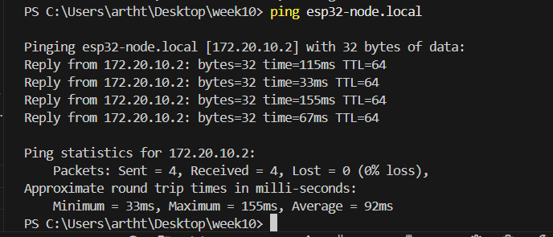
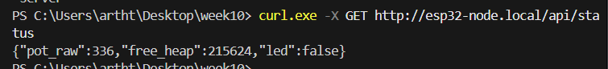
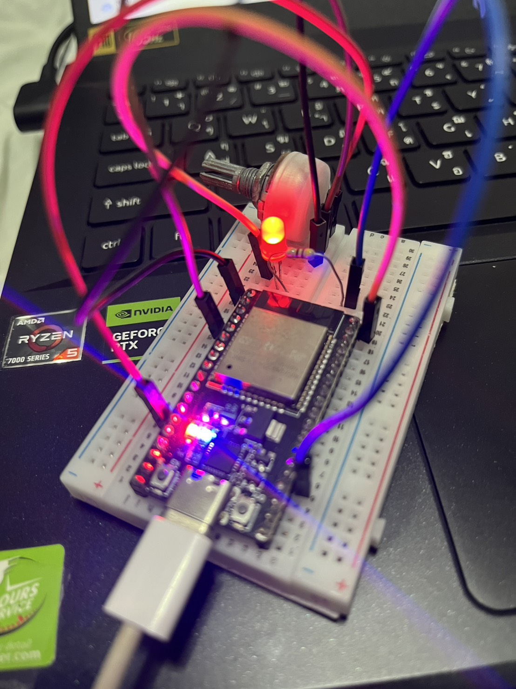
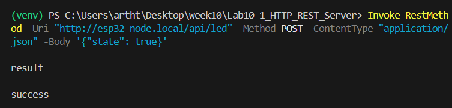
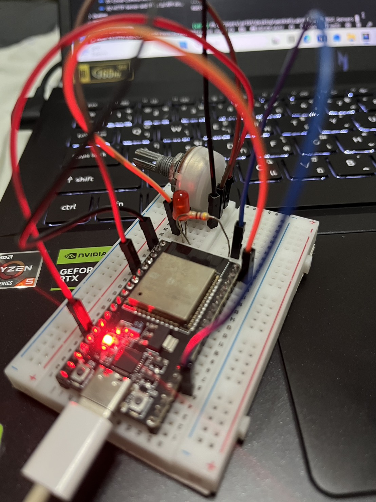
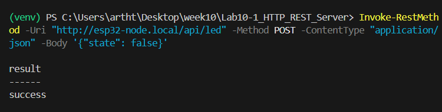

# ใบงานการทดลองที่ 10.1
### การพัฒนาระบบค้นหาอุปกรณ์ด้วย mDNS และเว็บเซิร์ฟเวอร์ควบคุมอุปกรณ์ผ่าน HTTP RESTful API บน ESP-IDF

> [!NOTE] **คำชี้แจง**
> ในใบงานนี้ นักศึกษาจะได้เรียนรู้การสร้างระบบ Local Control ด้วยการเปลี่ยนบอร์ด ESP32 ให้กลายเป็น **HTTP RESTful Web Server** โดยใช้คอมโพเนนต์ทางการของ ESP-IDF (`esp_http_server`) พร้อมทั้งติดตั้งระบบค้นหาชื่อโดเมนเสมือน **mDNS (Multicast DNS)** เพื่อให้คอมพิวเตอร์และโทรศัพท์มือถือสามารถเข้าถึง ESP32 ได้ผ่านชื่อ `http://esp32-node.local` โดยไม่ต้องจำหมายเลข IP

---

## 1. วัตถุประสงค์การทดลอง
1. เข้าใจกลไกการเชื่อมต่อเครือข่าย Wi-Fi ในโหมด Station (STA) ด้วยสแตก LwIP บน ESP-IDF
2. สามารถเปิดใช้งานและตั้งค่า mDNS Service Discovery เพื่อประกาศชื่อโฮสต์และบริการ HTTP ได้
3. สามารถพัฒนา RESTful API Endpoints (`GET /api/status` และ `POST /api/led`) ด้วยคอมโพเนนต์ `esp_http_server` ได้
4. สามารถประมวลผลข้อมูล JSON Payload (Parsing & Serialization) ด้วยไลบรารี `cJSON` ได้อย่างปลอดภัย
5. สามารถทดสอบส่งคำสั่งควบคุม LED (GPIO 2) และอ่านค่า Potentiometer (GPIO 34) ผ่านโปรแกรม `cURL` และสคริปต์ Python ได้

---

## 2. วงจรและการต่อสายฮาร์ดแวร์ (Schematic & Wiring)
<p align="center">
 
</p>
<p align="center">
<b> รูปที่ L10-1 </b> แผนภาพการต่อสาย ESP32 เข้ากับ LED (GPIO 2) และ Potentiometer (GPIO 34)
</p>

| อุปกรณ์                    | ขาอุปกรณ์      | ขาต่อบน ESP32  | หน้าที่                                 |
| :------------------------- | :------------- | :------------- | :-------------------------------------- |
| **Onboard / External LED** | ขาบวก (Anode)  | **GPIO 2**     | หลอดไฟแสดงสถานะการควบคุม Output         |
| **Potentiometer (10k)**    | ขากลาง (Wiper) | **GPIO 34**    | เซนเซอร์แอนะล็อกอินพุต (ADC1 Channel 6) |
| **Potentiometer (10k)**    | ขาซ้าย/ขวา     | **3.3V / GND** | แรงดันไฟเลี้ยงและกราวด์                 |

---

## 3. ขั้นตอนการทดลอง (Deconstructed Activities)

### กิจกรรมที่ 10-1.1 การสร้างโปรเจกต์ใหม่และตั้งค่าโครงสร้าง Dependency

#### 1. สร้างโปรเจกต์ใหม่
สร้างโฟลเดอร์โปรเจกต์ผ่านคำสั่ง ESP-IDF

```powershell
idf.py create-project Lab10-1_HTTP_REST_Server
cd Lab10-1_HTTP_REST_Server
```

**หรือรันผ่าน Docker**
```powershell
# รันคำสั่งสร้างโปรเจกต์ Lab10-1_HTTP_REST_Server ในโฟลเดอร์ปัจจุบัน
docker run --rm --mount "type=bind,source=$((Get-Location).Path),target=/workspace" -w /workspace espressif/idf:release-v6.1 idf.py create-project Lab10-1_HTTP_REST_Server

# เข้าสู่ไดเรกทอรีโปรเจกต์
cd Lab10-1_HTTP_REST_Server
```

#### 2. กำหนด Target เป็นชิป ESP32
```powershell
idf.py set-target esp32
```

**หรือรันผ่าน Docker (ต้อง cd เข้าไปใน  `Lab10-1_HTTP_REST_Server` ก่อนรันคำสั่ง)**
```powershell
docker run --rm --mount "type=bind,source=$((Get-Location).Path),target=/workspace" -w /workspace espressif/idf:release-v6.1 idf.py set-target esp32
```

#### 3. การเพิ่ม Dependency `mdns` และ `cjson` (IDF Component Manager)

> [!IMPORTANT] **ข้อควรทราบสำคัญสำหรับ ESP-IDF v5.x และ v6.x**
> ใน ESP-IDF เวอร์ชัน 5.0 ขึ้นไป คอมโพเนนต์ **`mdns`** และ **`cJSON`** ถูกแยกออกจากคอร์หลักของ ESP-IDF ย้ายไปยัง **IDF Component Registry** (`https://components.espressif.com`) 
> หากระบุ `REQUIRES mdns` หรือ `REQUIRES json` โดยตรงใน `CMakeLists.txt` ระบบจะแจ้งเตือนความผิดพลาดต่อไปนี้
> ```text
> HINT: The component 'mdns' could not be found... 
> component has been moved to the IDF component manager
> ```
> จึงจำเป็นต้องลงทะเบียน Dependency ผ่าน Component Manager ก่อนเสมอ

เพิ่มคอมโพเนนต์ `espressif/mdns` และ `espressif/cjson` เข้าโปรเจกต์ โดยรันคำสั่งต่อไปนี้

```powershell
idf.py add-dependency "espressif/mdns"
idf.py add-dependency "espressif/cjson"
```

**หรือรันผ่าน Docker (จากภายในโฟลเดอร์โปรเจกต์)**
```powershell
docker run --rm --mount "type=bind,source=$((Get-Location).Path),target=/workspace" -w /workspace espressif/idf:release-v6.1 idf.py add-dependency "espressif/mdns"
docker run --rm --mount "type=bind,source=$((Get-Location).Path),target=/workspace" -w /workspace espressif/idf:release-v6.1 idf.py add-dependency "espressif/cjson"
```

คำสั่ง add-dependency จะไปแก้ไขไฟล์ `idf_component.yml` ใน main และถ้ายังไม่มีไฟล์ดังกล่าว idf จะสร้างไฟล์ดังกล่าวให้โดยอัตโนมัติ
ผลลัพธ์ที่ได้จะมีหน้าตาคล้ายดังนี้
```yaml
dependencies:
  idf:
    version: "~6.0.0"
  espressif/mdns:
    version: "~3.1.0"
  espressif/cjson:
    version: "~1.8.1"  
```

*ถ้าไม่อยากรันสองคำสั่งด้านบน ให่สร้าง/ตรวจสอบไฟล์ `main/idf_component.yml` ให้มีเนื้อหาดังนี้*
```yaml
dependencies:
  idf:
    version: '>=4.1.0'
  espressif/mdns: '*'
  espressif/cjson: '*'
```

#### 4. ตั้งค่า `main/CMakeLists.txt`
เปิดไฟล์ `main/CMakeLists.txt` และตรวจสอบว่าได้เรียกใช้คอมโพเนนต์ที่จำเป็นครบถ้วน

```cmake
idf_component_register(SRCS "Lab10-1_HTTP_REST_Server.c"
                       INCLUDE_DIRS "."
                       REQUIRES esp_http_server mdns esp_wifi esp_event nvs_flash cjson esp_adc esp_driver_gpio)
```
*หมายเหตุ* 
1. ให้แทรกบรรทัด `REQUIRES esp_http_server mdns esp_wifi esp_event nvs_flash cjson esp_adc esp_driver_gpio` ระหว่าง `INCLUDE_DIRS "."` และ `)`
2. ใน ESP-IDF v6.x ให้ใช้ `cjson` แทน `json` และเพิ่ม `esp_driver_gpio` สำหรับควบคุมขา GPIO รวมถึงตรวจดูชื่อไฟล์ใน `SRCS` ให้ตรงกับไฟล์โค้ดจริงในโฟลเดอร์ `main`

#### 5. ทดสอบ Reconfigure ระบบบิลด์

ทดสอบรันคำสั่ง Reconfigure เพื่อให้ระบบดาวน์โหลดคอมโพเนนต์และสร้างบิลด์ไฟล์
```powershell
idf.py reconfigure
```

**หรือรันผ่าน Docker**
```powershell
docker run --rm --mount "type=bind,source=$((Get-Location).Path),target=/workspace" -w /workspace espressif/idf:release-v6.1 idf.py reconfigure
```

เมื่อปรากฏข้อความ `-- Configuring done` และ `-- Generating done` แสดงว่าโครงสร้างโปรเจกต์พร้อมสำหรับการเขียนโค้ดในกิจกรรมถัดไป


---
### กิจกรรมที่ 10-1.2 การติดตั้งและเปิดใช้งานบริการ mDNS

ในไฟล์ `main/Lab10-1_HTTP_REST_Server.c` เขียนฟังก์ชันสำหรับเริ่มต้นระบบ mDNS

```c
#include "mdns.h"

static void initialise_mdns(void)
{
    // กำหนดค่าเริ่มต้นให้กับ mDNS
    ESP_ERROR_CHECK(mdns_init());
    
    // กำหนดชื่อโฮสต์สำหรับเข้าถึง: http://esp32-node.local
    ESP_ERROR_CHECK(mdns_hostname_set("esp32-node"));
    ESP_ERROR_CHECK(mdns_instance_name_set("ESP32 RESTful Controller"));

    // ประกาศบริการ HTTP พอร์ต 80
    mdns_txt_item_t serviceTxtData[] = {
        {"board", "esp32"},
        {"role", "actuator"}
    };
    ESP_ERROR_CHECK(mdns_service_add("ESP32-WebControl", "_http", "_tcp", 80, serviceTxtData, 2));
    ESP_LOGI("mDNS", "mDNS initialized! Hostname: esp32-node.local");
}
```

---

### กิจกรรมที่ 10-1.3  การพัฒนา REST API Endpoints บน `esp_http_server`

เขียนฟังก์ชัน Handler สำหรับรองรับคำสั่ง **GET** และ **POST**

```c
#include <esp_http_server.h>
#include "cJSON.h"
#include "driver/gpio.h"

// 1. GET /api/status - อ่านค่าเซนเซอร์และสถานะระบบ
static esp_err_t status_get_handler(httpd_req_t *req)
{
    cJSON *root = cJSON_CreateObject();
    cJSON_AddNumberToObject(root, "pot_raw", 2048); // แทนที่ด้วยฟังก์ชันอ่าน ADC จาก GPIO 34
    cJSON_AddNumberToObject(root, "free_heap", esp_get_free_heap_size());
    cJSON_AddBoolToObject(root, "led", gpio_get_level(GPIO_NUM_2));

    const char *resp = cJSON_PrintUnformatted(root);
    httpd_resp_set_type(req, "application/json");
    httpd_resp_send(req, resp, strlen(resp));

    cJSON_free((void *)resp);
    cJSON_Delete(root);
    return ESP_OK;
}

// 2. POST /api/led - ควบคุมหลอดไฟ LED
static esp_err_t led_post_handler(httpd_req_t *req)
{
    char buf[128];
    int ret = httpd_req_recv(req, buf, sizeof(buf) - 1);
    if (ret <= 0) {
        httpd_resp_send_500(req);
        return ESP_FAIL;
    }
    buf[ret] = '\0';

    cJSON *root = cJSON_Parse(buf);
    if (root != NULL) {
        cJSON *state = cJSON_GetObjectItem(root, "state");
        if (cJSON_IsBool(state)) {
            bool led_on = cJSON_IsTrue(state);
            gpio_set_level(GPIO_NUM_2, led_on ? 1 : 0);
            ESP_LOGI("HTTP", "LED switched to: %d", led_on);
        }
        cJSON_Delete(root);
    }

    const char *resp = "{\"result\":\"success\"}";
    httpd_resp_set_type(req, "application/json");
    httpd_resp_send(req, resp, strlen(resp));
    return ESP_OK;
}
```

---

### กิจกรรมที่ 10-1.4 การจัดการระบบ Wi-Fi และการเริ่มต้นระบบทั้งหมดใน `app_main()`

ในกิจกรรมนี้ นักศึกษาจะผูกระบบทั้งหมดเข้าด้วยกัน โดยประกอบด้วย
1. การเชื่อมต่อ Wi-Fi Station
2. การเริ่มต้นระบบ mDNS
3. การเริ่มต้น Web Server และลงทะเบียน URI Endpoints
4. การตั้งค่าฮาร์ดแวร์ GPIO 2 (LED) และ ADC1 Channel 6 (Potentiometer บน GPIO 34)

#### 1. ฟังก์ชันเริ่มต้น HTTP Web Server (`start_webserver`)
```c
static httpd_handle_t start_webserver(void)
{
    httpd_config_t config = HTTPD_DEFAULT_CONFIG();
    config.lru_purge_enable = true; // เคลียร์เซสชันค้างอัตโนมัติ

    httpd_uri_t uri_get_status = {
        .uri      = "/api/status",
        .method   = HTTP_GET,
        .handler  = status_get_handler,
        .user_ctx = NULL
    };

    httpd_uri_t uri_post_led = {
        .uri      = "/api/led",
        .method   = HTTP_POST,
        .handler  = led_post_handler,
        .user_ctx = NULL
    };

    httpd_handle_t server = NULL;
    if (httpd_start(&server, &config) == ESP_OK) {
        httpd_register_uri_handler(server, &uri_get_status);
        httpd_register_uri_handler(server, &uri_post_led);
        ESP_LOGI("HTTP", "HTTP Server started on port %d", config.server_port);
        return server;
    }

    ESP_LOGE("HTTP", "Failed to start HTTP server!");
    return NULL;
}
```

#### 2. ฟังก์ชันหลัก `app_main(void)`
```c
void app_main(void)
{
    // 1. กำหนดค่าเริ่มต้น NVS Flash (จำเป็นสำหรับระบบ Wi-Fi)
    esp_err_t ret = nvs_flash_init();
    if (ret == ESP_ERR_NVS_NO_FREE_PAGES || ret == ESP_ERR_NVS_NEW_VERSION_FOUND) {
        ESP_ERROR_CHECK(nvs_flash_erase());
        ret = nvs_flash_init();
    }
    ESP_ERROR_CHECK(ret);

    // 2. กำหนดค่าขา GPIO 2 สำหรับ LED Output (เปิดโหมด INPUT_OUTPUT เพื่อให้อ่านสถานะได้)
    gpio_reset_pin(GPIO_NUM_2);
    gpio_set_direction(GPIO_NUM_2, GPIO_MODE_INPUT_OUTPUT);

    // 3. กำหนดค่า ADC1 สำหรับอ่านค่า Potentiometer (GPIO 34)
    adc_oneshot_unit_init_cfg_t init_config1 = {
        .unit_id = ADC_UNIT_1,
    };
    if (adc_oneshot_new_unit(&init_config1, &s_adc1_handle) == ESP_OK) {
        adc_oneshot_chan_cfg_t chan_config = {
            .bitwidth = ADC_BITWIDTH_DEFAULT,
            .atten = ADC_ATTEN_DB_12,
        };
        adc_oneshot_config_channel(s_adc1_handle, ADC_CHANNEL_6, &chan_config);
        ESP_LOGI("ADC", "ADC1 Initialized on GPIO 34 (Channel 6)");
    }

    // 4. เริ่มต้นเชื่อมต่อ Wi-Fi
    if (wifi_init_sta()) {
        // 5. เริ่มต้น mDNS Service Discovery (http://esp32-node.local)
        initialise_mdns();

        // 6. เริ่มต้น HTTP RESTful Web Server
        s_http_server = start_webserver();
        ESP_LOGI("MAIN", "Ready! Test with: curl http://esp32-node.local/api/status");
    } else {
        ESP_LOGE("MAIN", "Cannot start server due to Wi-Fi connection failure.");
    }
}
```


### ตารางสรุป Header Files ที่ต้องใส่ใน  `Lab10-1_HTTP_REST_Server.c` และหน้าที่การทำงาน

| Header file               | หน้าที่และขอบเขตการใช้งานในแล็บนี้                                                                               |
| :------------------------ | :--------------------------------------------------------------------------------------------------------------- |
| `stdio.h`                 | ฟังก์ชันมาตรฐานภาษา C สำหรับการจัดการ Input/Output เช่น การจัดรูปแบบข้อความด้วย `snprintf()`                     |
| `string.h`                | ฟังก์ชันจัดการสตริงและบล็อกหน่วยความจำ เช่น `strlen()`, `memset()`, `memcpy()`                                   |
| `esp_log.h`               | ระบบส่งข้อความแจ้งเตือนและดีบั๊ก (Logging) ของ ESP-IDF เช่น `ESP_LOGI()`, `ESP_LOGE()`, `ESP_LOGW()`             |
| `nvs_flash.h`             | จัดการ Non-Volatile Storage (NVS) เพื่อเก็บการตั้งค่าระดับฟิสิคัล ซึ่งจำเป็นต่อการเริ่มระบบ Wi-Fi Driver         |
| `esp_netif.h`             | ตัวกลางจัดการ TCP/IP Network Interface Adapter (เชื่อมโยงระหว่างไดรเวอร์เครือข่ายและสแตก LwIP)                   |
| `esp_event.h`             | ระบบ Default Event Loop ของ ESP-IDF สำหรับกระจายและดักรับเหตุการณ์ของระบบ (เช่น Wi-Fi connected, IP acquired)    |
| `esp_wifi.h`              | ไดรเวอร์ควบคุมวิทยุ Wi-Fi ทั้งหมด (การกำหนดโหมด Station, การตั้งค่า SSID/Password, และการเชื่อมต่อ AP)           |
| `freertos/FreeRTOS.h`     | โครงสร้างหลัก ไทป์ตัวแปร และมาโครพื้นฐานของระบบปฏิบัติการเวลาจริง FreeRTOS                                       |
| `freertos/task.h`         | การจัดการงาน (Tasks), การสลับบริบทการทำงาน และการหน่วงเวลา (`vTaskDelay`, `portMAX_DELAY`)                       |
| `freertos/event_groups.h` | กลไก Event Group สำหรับ Synchronization ซิงค์สถานะระหว่าง Event Loop กับ Task หลักด้วย Event Bits                |
| `esp_http_server.h`       | คอมโพเนนต์ HTTP Server ทางการของ ESP-IDF สำหรับจัดการ HTTP Requests, รับ/ส่ง Header, และลงทะเบียน URI Handlers   |
| `cJSON.h`                 | ไลบรารีสำหรับพาร์สข้อมูล (JSON Parsing) และสร้างสตริง JSON Payload (JSON Serialization) ตอบกลับไคลเอนต์          |
| `driver/gpio.h`           | ไดรเวอร์ควบคุมขา Hardware GPIO (กำหนดทิศทาง Input/Output และอ่าน/เขียนระดับสัญญาณเปิด-ปิดไฟ LED)                 |
| `mdns.h`                  | คอมโพเนนต์ Multicast DNS (mDNS) สำหรับประกาศชื่อโฮสต์เสมือน (`esp32-node.local`) และบริการ DNS-SD บนเครือข่ายแลน |
| `esp_adc/adc_oneshot.h`   | ไดรเวอร์ ADC โหมด Oneshot บน ESP-IDF v5/v6 สำหรับอ่านค่าแรงดันอนาล็อกจาก Potentiometer (GPIO 34)                 |

<details>
<summary><b>🔍 คลิกดูซอร์สโค้ดฉบับสมบูรณ์ทั้งไฟล์ (Lab10-1_HTTP_REST_Server.c)</b></summary>

```c
#include <stdio.h>
#include <string.h>
#include "esp_log.h"
#include "nvs_flash.h"
#include "esp_netif.h"
#include "esp_event.h"
#include "esp_wifi.h"
#include "freertos/FreeRTOS.h"
#include "freertos/task.h"
#include "freertos/event_groups.h"
#include "esp_http_server.h"
#include "cJSON.h"
#include "driver/gpio.h"
#include "mdns.h"
#include "esp_adc/adc_oneshot.h"

#define TAG "HTTP_REST_LAB"

// กำหนดชื่อและรหัสผ่าน Wi-Fi (แก้ไขให้ตรงกับ Access Point ของตนเอง)
#define CONFIG_WIFI_SSID      "YOUR_WIFI_SSID"
#define CONFIG_WIFI_PASSWORD  "YOUR_WIFI_PASSWORD"
#define MAXIMUM_RETRY         5

#define LED_GPIO_PIN          GPIO_NUM_2
#define POT_ADC_CHANNEL       ADC_CHANNEL_6 // GPIO 34 (ADC1 Channel 6)

static EventGroupHandle_t s_wifi_event_group;
#define WIFI_CONNECTED_BIT    BIT0
#define WIFI_FAIL_BIT         BIT1

static int s_retry_num = 0;
static adc_oneshot_unit_handle_t s_adc1_handle = NULL;
static httpd_handle_t s_http_server = NULL;

// Wi-Fi Event Handler
static void wifi_event_handler(void* arg, esp_event_base_t event_base,
                               int32_t event_id, void* event_data)
{
    if (event_base == WIFI_EVENT && event_id == WIFI_EVENT_STA_START) {
        esp_wifi_connect();
    } else if (event_base == WIFI_EVENT && event_id == WIFI_EVENT_STA_DISCONNECTED) {
        if (s_retry_num < MAXIMUM_RETRY) {
            esp_wifi_connect();
            s_retry_num++;
            ESP_LOGI(TAG, "Retrying Wi-Fi connection (%d/%d)...", s_retry_num, MAXIMUM_RETRY);
        } else {
            xEventGroupSetBits(s_wifi_event_group, WIFI_FAIL_BIT);
            ESP_LOGE(TAG, "Failed to connect to Wi-Fi");
        }
    } else if (event_base == IP_EVENT && event_id == IP_EVENT_STA_GOT_IP) {
        ip_event_got_ip_t* event = (ip_event_got_ip_t*) event_data;
        ESP_LOGI(TAG, "Wi-Fi Connected! IP Address: " IPSTR, IP2STR(&event->ip_info.ip));
        s_retry_num = 0;
        xEventGroupSetBits(s_wifi_event_group, WIFI_CONNECTED_BIT);
    }
}

// เริ่มต้นระบบเชื่อมต่อ Wi-Fi Station
static bool wifi_init_sta(void)
{
    s_wifi_event_group = xEventGroupCreate();

    ESP_ERROR_CHECK(esp_netif_init());
    ESP_ERROR_CHECK(esp_event_loop_create_default());
    esp_netif_create_default_wifi_sta();

    wifi_init_config_t cfg = WIFI_INIT_CONFIG_DEFAULT();
    ESP_ERROR_CHECK(esp_wifi_init(&cfg));

    esp_event_handler_instance_t instance_any_id;
    esp_event_handler_instance_t instance_got_ip;
    ESP_ERROR_CHECK(esp_event_handler_instance_register(WIFI_EVENT,
                                                        ESP_EVENT_ANY_ID,
                                                        &wifi_event_handler,
                                                        NULL,
                                                        &instance_any_id));
    ESP_ERROR_CHECK(esp_event_handler_instance_register(IP_EVENT,
                                                        IP_EVENT_STA_GOT_IP,
                                                        &wifi_event_handler,
                                                        NULL,
                                                        &instance_got_ip));

    wifi_config_t wifi_config = {
        .sta = {
            .threshold.authmode = WIFI_AUTH_WPA2_PSK,
        },
    };
    size_t ssid_len = strlen(CONFIG_WIFI_SSID);
    if (ssid_len > sizeof(wifi_config.sta.ssid)) ssid_len = sizeof(wifi_config.sta.ssid);
    memcpy(wifi_config.sta.ssid, CONFIG_WIFI_SSID, ssid_len);

    size_t pass_len = strlen(CONFIG_WIFI_PASSWORD);
    if (pass_len > sizeof(wifi_config.sta.password)) pass_len = sizeof(wifi_config.sta.password);
    memcpy(wifi_config.sta.password, CONFIG_WIFI_PASSWORD, pass_len);
    ESP_ERROR_CHECK(esp_wifi_set_mode(WIFI_MODE_STA));
    ESP_ERROR_CHECK(esp_wifi_set_config(WIFI_IF_STA, &wifi_config));
    ESP_ERROR_CHECK(esp_wifi_start());

    ESP_LOGI(TAG, "Connecting to SSID: %s ...", CONFIG_WIFI_SSID);

    EventBits_t bits = xEventGroupWaitBits(s_wifi_event_group,
            WIFI_CONNECTED_BIT | WIFI_FAIL_BIT,
            pdFALSE,
            pdFALSE,
            portMAX_DELAY);

    if (bits & WIFI_CONNECTED_BIT) {
        ESP_LOGI(TAG, "Connected to AP successfully!");
        return true;
    } else {
        ESP_LOGE(TAG, "Failed to connect to AP");
        return false;
    }
}

// กำหนดค่าเริ่มต้นให้กับ mDNS
static void initialise_mdns(void)
{
    ESP_ERROR_CHECK(mdns_init());
    ESP_ERROR_CHECK(mdns_hostname_set("esp32-node"));
    ESP_ERROR_CHECK(mdns_instance_name_set("ESP32 RESTful Controller"));

    mdns_txt_item_t serviceTxtData[] = {
        {"board", "esp32"},
        {"role", "actuator"}
    };
    ESP_ERROR_CHECK(mdns_service_add("ESP32-WebControl", "_http", "_tcp", 80, serviceTxtData, 2));
    ESP_LOGI(TAG, "mDNS initialized! Hostname: http://esp32-node.local");
}

// 1. GET /api/status - อ่านค่าเซนเซอร์และสถานะระบบ
static esp_err_t status_get_handler(httpd_req_t *req)
{
    int pot_val = 0;
    if (s_adc1_handle != NULL) {
        adc_oneshot_read(s_adc1_handle, POT_ADC_CHANNEL, &pot_val);
    }

    cJSON *root = cJSON_CreateObject();
    cJSON_AddNumberToObject(root, "pot_raw", pot_val);
    cJSON_AddNumberToObject(root, "free_heap", esp_get_free_heap_size());
    cJSON_AddBoolToObject(root, "led", gpio_get_level(LED_GPIO_PIN));

    const char *resp = cJSON_PrintUnformatted(root);
    httpd_resp_set_type(req, "application/json");
    httpd_resp_send(req, resp, strlen(resp));

    cJSON_free((void *)resp);
    cJSON_Delete(root);
    return ESP_OK;
}

// 2. POST /api/led - ควบคุมหลอดไฟ LED
static esp_err_t led_post_handler(httpd_req_t *req)
{
    char buf[128];
    int ret = httpd_req_recv(req, buf, sizeof(buf) - 1);
    if (ret <= 0) {
        httpd_resp_send_500(req);
        return ESP_FAIL;
    }
    buf[ret] = '\0';

    cJSON *root = cJSON_Parse(buf);
    if (root != NULL) {
        cJSON *state = cJSON_GetObjectItem(root, "state");
        if (cJSON_IsBool(state)) {
            bool led_on = cJSON_IsTrue(state);
            gpio_set_level(LED_GPIO_PIN, led_on ? 1 : 0);
            ESP_LOGI(TAG, "LED (GPIO %d) switched to: %s", LED_GPIO_PIN, led_on ? "ON" : "OFF");
        }
        cJSON_Delete(root);
    }

    const char *resp = "{\"result\":\"success\"}";
    httpd_resp_set_type(req, "application/json");
    httpd_resp_send(req, resp, strlen(resp));
    return ESP_OK;
}

// เริ่มต้น HTTP Web Server และลงทะเบียน URI Handlers
static httpd_handle_t start_webserver(void)
{
    httpd_config_t config = HTTPD_DEFAULT_CONFIG();
    config.lru_purge_enable = true;

    httpd_uri_t uri_get_status = {
        .uri      = "/api/status",
        .method   = HTTP_GET,
        .handler  = status_get_handler,
        .user_ctx = NULL
    };

    httpd_uri_t uri_post_led = {
        .uri      = "/api/led",
        .method   = HTTP_POST,
        .handler  = led_post_handler,
        .user_ctx = NULL
    };

    httpd_handle_t server = NULL;
    if (httpd_start(&server, &config) == ESP_OK) {
        httpd_register_uri_handler(server, &uri_get_status);
        httpd_register_uri_handler(server, &uri_post_led);
        ESP_LOGI(TAG, "HTTP Server started on port %d", config.server_port);
        return server;
    }

    ESP_LOGE(TAG, "Failed to start HTTP server!");
    return NULL;
}

void app_main(void)
{
    // 1. กำหนดค่าเริ่มต้น NVS Flash (จำเป็นสำหรับ Wi-Fi)
    esp_err_t ret = nvs_flash_init();
    if (ret == ESP_ERR_NVS_NO_FREE_PAGES || ret == ESP_ERR_NVS_NEW_VERSION_FOUND) {
        ESP_ERROR_CHECK(nvs_flash_erase());
        ret = nvs_flash_init();
    }
    ESP_ERROR_CHECK(ret);

    // 2. กำหนดค่าขา GPIO 2 เป็น Output สำหรับควบคุม LED
    gpio_reset_pin(LED_GPIO_PIN);
    gpio_set_direction(LED_GPIO_PIN, GPIO_MODE_INPUT_OUTPUT);

    // 3. กำหนดค่า ADC1 สำหรับ Potentiometer (GPIO 34)
    adc_oneshot_unit_init_cfg_t init_config1 = {
        .unit_id = ADC_UNIT_1,
    };
    if (adc_oneshot_new_unit(&init_config1, &s_adc1_handle) == ESP_OK) {
        adc_oneshot_chan_cfg_t chan_config = {
            .bitwidth = ADC_BITWIDTH_DEFAULT,
            .atten = ADC_ATTEN_DB_12,
        };
        adc_oneshot_config_channel(s_adc1_handle, POT_ADC_CHANNEL, &chan_config);
        ESP_LOGI(TAG, "ADC Initialized on GPIO 34 (Channel 6)");
    }

    // 4. เชื่อมต่อระบบ Wi-Fi
    if (wifi_init_sta()) {
        // 5. เริ่มต้น mDNS Service Discovery
        initialise_mdns();

        // 6. เริ่มต้น HTTP RESTful Web Server
        s_http_server = start_webserver();
        ESP_LOGI(TAG, "Ready! Test with: curl http://esp32-node.local/api/status");
    } else {
        ESP_LOGE(TAG, "Cannot start server due to Wi-Fi connection failure.");
    }
}
```
</details>

#### 3. คำสั่งคอมไพล์โปรเจกต์ (Build)
```powershell
idf.py build
```

**หรือคอมไพล์ผ่าน Docker**
```powershell
docker run --rm --mount "type=bind,source=$((Get-Location).Path),target=/workspace" -w /workspace espressif/idf:release-v6.1 idf.py build
```

#### 4. คำสั่ง Flash โปรเจกต์


```powershell
idf.py flash -p <COMxx>
```

**หรือคอมไพล์ผ่าน Docker**
```powershell
python -m esptool -p <COMxx> --chip esp32 -b 460800 --before default_reset --after hard_reset write_flash --flash_mode dio --flash_size 2MB --flash_freq 40m 0x1000  build/bootloader/bootloader.bin 0x8000  build/partition_table/partition-table.bin 0x10000 build/Lab10-1_HTTP_REST_Server.bin && idf monitor -p <COMxx>
```


---

### กิจกรรมที่ 10-1.5 การทดสอบและตรวจพิสูจน์ (Verification & Forensics)

#### 1. ตรวจสอบ mDNS ด้วยคำสั่ง ping
เปิด Terminal บนเครื่องคอมพิวเตอร์ที่อยู่ในวง Wi-Fi เดียวกัน
```powershell
ping esp32-node.local
```
*(บันทึกภาพผลการ Ping และหมายเลข IP ที่ Resolve ได้ เช่น `Reply from 192.168.1.181`)*

> [!TIP] **คู่มือการแก้ไขปัญหาเมื่อ Resolve ชื่อ `esp32-node.local` ไม่พบ (Troubleshooting Guide)**
> หากคำสั่ง `ping esp32-node.local` ขึ้นข้อความ `could not find host` ให้ตรวจสอบ 2 จุดสำคัญดังนี้
> 1. **เปลี่ยนสถานะ Wi-Fi บน Windows เป็น "Private Network"**
>    เปิด **Settings** $\rightarrow$ **Network & internet** $\rightarrow$ **Wi-Fi** $\rightarrow$ คลิกที่ชื่อเครือข่าย Wi-Fi ที่เชื่อมต่อ $\rightarrow$ เปลี่ยนจาก **Public network** เป็น **Private network** (เนื่องจาก Public network บน Windows จะสั่ง Firewall บล็อกแพ็กเก็ต mDNS UDP 5353 ขาเข้าทั้งหมด)
> 2. **ปิดหรือถอดสาย LAN ที่ต่อซ้อนอยู่**
>    หากเครื่องคอมพิวเตอร์เสียบสาย LAN ไว้ด้วย Windows จะจัดลำดับ Routing Metric ให้สาย LAN สูงกว่า Wi-Fi เสมอ ทำให้แพ็กเก็ต Multicast (`224.0.0.251`) ถูกส่งออกไปทางสาย LAN แทนที่จะเป็น Wi-Fi ที่ ESP32 เกาะอยู่ ให้ปิด (Disable) การ์ดแลนหรือถอดสาย LAN ออกชั่วคราวขณะทดสอบ mDNS



#### 2. ทดสอบอ่านค่าเซนเซอร์ผ่าน cURL
เปิด PowerShell แล้วรันคำสั่ง (แนะนำให้พิมพ์ `curl.exe` เพื่อเรียกใช้โปรแกรม cURL แท้ของระบบแทน PowerShell Alias)
```powershell
curl.exe -X GET http://esp32-node.local/api/status
```
ผลลัพธ์ที่ได้จะเป็น JSON Payload เช่น
```json
{"pot_raw":15,"free_heap":213848,"led":true}
```



#### 3. ทดสอบสั่งเปิด-ปิด LED ผ่าน cURL หรือ PowerShell

**วิธีที่ 1 ใช้ `curl.exe` (ครอบสตริง JSON ด้วย Single Quote เพื่อป้องกัน PowerShell ตัดเครื่องหมายคำพูด)**
```powershell
# สั่งเปิดไฟ LED (GPIO 2)
curl.exe -s -X POST http://esp32-node.local/api/led -H "Content-Type: application/json" -d '{\"state\": true}'

# สั่งปิดไฟ LED (GPIO 2)
curl.exe -s -X POST http://esp32-node.local/api/led -H "Content-Type: application/json" -d '{\"state\": false}'
```
การเปิดและปิดไฟ จะได้ผลลัพธ์เป็น `{"result":"success"}` ทั้งคู่


**วิธีที่ 2 ใช้คำสั่ง `Invoke-RestMethod` ของ PowerShell โดยตรง (แนะนำสำหรับ Windows)**
```powershell
# สั่งเปิดไฟ LED
Invoke-RestMethod -Uri "http://esp32-node.local/api/led" -Method POST -ContentType "application/json" -Body '{"state": true}'

# สั่งปิดไฟ LED
Invoke-RestMethod -Uri "http://esp32-node.local/api/led" -Method POST -ContentType "application/json" -Body '{"state": false}'
```
#### สามารถสังเกตสถานะหลอดไฟ LED บนบอร์ด ESP32 ติด/ดับตามคำสั่ง และข้อความตอบกลับ เป็น 

```
result
------
success
```




---

## 4. บันทึกผลการทดลอง

### 4.1 สรุปผลการทดสอบการทำงานของระบบ

จากการทดลองเชื่อมต่อและสื่อสารกับบอร์ด ESP32 ผ่านเครือข่ายแลนท้องถิ่น (Local Network) สรุปผลการทำงานได้ดังนี้:

| รายการทดสอบ | คำสั่ง / วิธีการ | ผลการทดลองที่สังเกตได้ | สถานะ |
| :--- | :--- | :--- | :---: |
| **1. การค้นหาอุปกรณ์ด้วย mDNS** | `ping esp32-node.local` | คอมพิวเตอร์สามารถ Resolve ชื่อโฮสต์เป็นหมายเลข IP ของ ESP32 ได้สำเร็จ และได้รับแพ็กเก็ตตอบกลับ | ผ่าน |
| **2. การอ่านค่าเซนเซอร์ (HTTP GET)** | `curl.exe http://esp32-node.local/api/status` | เซิร์ฟเวอร์ตอบกลับข้อมูลเป็น JSON Payload ประกอบด้วยค่า ADC ของ Potentiometer, ขนาด Free Heap และสถานะ LED ปัจจุบัน | ผ่าน |
| **3. การควบคุมหลอดไฟ (HTTP POST)** | ส่ง JSON `{"state": true}` / `{"state": false}` ไปยัง `/api/led` | หลอดไฟ LED (GPIO 2) บนบอร์ด ESP32 ติดและดับตามคำสั่งที่ส่งไป และได้รับข้อความตอบกลับ `{"result":"success"}` | ผ่าน |

---

### 4.2 ผลการวิเคราะห์ HTTP Header และ JSON Payload (`curl -i`)

ทดสอบยิงคำสั่ง `curl.exe -i http://esp32-node.local/api/status` เพื่อดูรายละเอียด HTTP Response Header:

**ผลการรันคำสั่ง:**
```http
HTTP/1.1 200 OK
Content-Type: application/json
Content-Length: 47

{"pot_raw":4095,"free_heap":215488,"led":false}
```

**ผลการวิเคราะห์ขนาดข้อมูล:**
* **HTTP Response Header:** มีขนาดรวม **71 ไบต์**  
  (คำนวณจากบรรทัด `HTTP/1.1 200 OK\r\n` (17 ไบต์) + `Content-Type: application/json\r\n` (32 ไบต์) + `Content-Length: 47\r\n` (20 ไบต์) + บรรทัดว่างปิด Header `\r\n` (2 ไบต์))
* **ข้อมูล JSON (Payload Body):** มีขนาด **47 ไบต์** (ตรงตามที่ระบุในฟิลด์ `Content-Length: 47`)
* **สรุปผลการวิเคราะห์:**  
  จากการวัดขนาดพบว่า HTTP Header (71 ไบต์) มีขนาดใหญ่กว่าตัวข้อมูล JSON จริงๆ (47 ไบต์) คิดเป็น Overhead ของโพรโทคอลมากกว่า 60% ของข้อมูลทั้งหมด ซึ่งแสดงให้เห็นว่าการใช้ HTTP RESTful ในการรับส่งข้อมูลขนาดเล็กมากๆ บนอุปกรณ์ IoT จะสูญเสียแบนด์วิดท์และพลังงานไปกับส่วนควบคุมของ Header ค่อนข้างสูง

---

## 5. คำถามท้ายการทดลอง

### 1. หากในเครือข่ายมีคอมพิวเตอร์ที่ไม่รองรับ mDNS หรือปิดกั้นพอร์ต UDP 5353 จะเกิดผลกระทบอย่างไร และแก้ไขได้อย่างไร?

* **ผลกระทบ:**  
  คอมพิวเตอร์จะไม่สามารถค้นหาหรือแปลงชื่อโดเมนเสมือน `esp32-node.local` ให้เป็นหมายเลข IP Address ของบอร์ด ESP32 ได้ ส่งผลให้เมื่อใช้คำสั่ง ping หรือเรียกผ่านเว็บเบราว์เซอร์/cURL จะแจ้งข้อผิดพลาดว่าหาโฮสต์ไม่พบ (Could not resolve host / Destination host unreachable)
* **วิธีแก้ไข:**
  1. **เข้าใช้งานผ่าน IP Address โดยตรง:** ให้ใช้หมายเลข IP ของบอร์ด ESP32 แทนชื่อโฮสต์ เช่น `http://172.20.10.2/api/status` (สามารถดู IP ได้จากหน้าต่าง Serial Monitor ขณะบอร์ดเริ่มทำงาน หรือตรวจสอบจากหน้ารายชื่ออุปกรณ์ที่เชื่อมต่อกับเราเตอร์/Hotspot)
  2. **ปรับการตั้งค่าเครือข่าย (Windows Network Profile):** เปลี่ยนการตั้งค่า Wi-Fi จาก **Public network** ให้เป็น **Private network** เพื่อให้ Windows Firewall ยินยอมให้แพ็กเก็ต Multicast พอร์ต UDP 5353 ผ่านเข้ามาได้
  3. **การกำหนด Fixed/Static IP:** กำหนดหมายเลข IP แบบคงที่ให้กับ ESP32 บนเราเตอร์ (DHCP Reservation) เพื่อความสะดวกในการอ้างอิงและใช้งานระยะยาว

---

### 2. เหตุใดจึงต้องเรียกคำสั่ง `cJSON_Delete(root)` และ `cJSON_free(resp)` เสมอหลังจากประมวลผลเสร็จสิ้น?

* **เหตุผล:**
  1. **การคืนหน่วยความจำที่จองไว้บน Heap:** ไลบรารี cJSON มีการจัดสรรพื้นที่หน่วยความจำแรมแบบพลวัต (Dynamic Memory Allocation) โดยใช้ฟังก์ชัน `malloc()` ทั้งในขั้นตอนสร้างออบเจกต์โครงสร้างข้อมูล (`cJSON_CreateObject`) และขั้นตอนการแปลงออบเจกต์เป็นสตริงข้อความ (`cJSON_PrintUnformatted`)
  2. **ป้องกันปัญหาหน่วยความจำรั่วไหล (Memory Leak):** บอร์ดไมโครคอนโทรลเลอร์ ESP32 มีหน่วยความจำแรม (Heap Memory) อยู่อย่างจำกัด หากมีไคลเอนต์ส่ง Request เข้ามาซ้ำๆ แล้วเซิร์ฟเวอร์ไม่ได้สั่งคืนพื้นที่หน่วยความจำ แรมที่ว่างอยู่จะค่อยๆ ลดลงเรื่อยๆ จนกระทั่งหมดลง
  3. **รักษาความเสถียรของระบบ:** เมื่อหน่วยความจำ Heap เต็ม (Out of Memory) ระบบจะไม่สามารถจัดสรรแรมสำหรับงานอื่นหรือรับคำขอใหม่ได้ ส่งผลให้โปรแกรมขัดข้องและเกิด Kernel Panic จนตัวบอร์ดรีเซ็ตตัวเอง (Crash & Reboot) ดังนั้นการเรียก `cJSON_free((void *)resp)` และ `cJSON_Delete(root)` ทุกครั้งหลังส่งข้อมูลเสร็จสิ้น จึงเป็นขั้นตอนสำคัญในการรักษาความเสถียรของระบบ IoT


